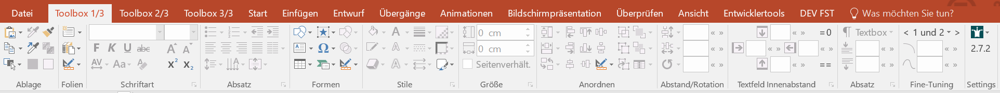

## Einführung

Die BKT besteht aus 2 Teilen, dem **BKT-Framework** und der **BKT-Toolbox**. Das Framework bietet eine einfach Möglichkeit, um Office-Addins für PowerPoint, Excel, Word, Outlook oder Visio in Python zu schreiben. Die BKT-Toolbox gibt es aktuell für PowerPoint, Excel und Visio.

Die PowerPoint-Toolbox fügt mehrere Tabs hinzu, die einen strukturierten Zugriff auf alle Standard-Funktionen von PowerPoint bieten, ergänzt um viele bisher fehlende Funktionen.

Die BKT wird von uns in der Freizeit entwickelt, daher können wir keinen Support anbieten oder auf spezielle Wünsche eingehen.

## Systemvoraussetzungen

Die BKT läuft unter **Windows ab Office 2010** in allen aktuellen Office-Versionen. Eine Mac-Version ist nicht verfügbar, da die entsprechende Office-Schnittstelle (COM-Addin) im Mac-Office nicht von Microsoft angeboten wird.

Wir bieten den **Vorgänger der BKT** als [Legacy Toolbar](legacy.md) an, welche in VBA geschrieben ist und daher größtenteils **auch unter Mac** funktioniert. Ein detallierter [**Vergleich** der BKT mit der Legacy-Toolbar ist hier](comparison.md).

## Bekannte Probleme

 * Da die IronPython-Umgebung erst hochfahren muss, verzögert sich der PowerPoint-Start mit aktiviertem Addin. Wir arbeiten daran, diesen Effekt etwas zu minimieren.
 * Wenn im Hintergrund eine PowerPoint-Präsentation in der geschützten Ansicht geöffnet ist, reagiert PowerPoint mit Toolbox unvorhersehbar, bspw. werden Selektionen nicht mehr richtig angenommen. Dies scheint ein PPT-Bug zu sein, den wir leider nicht fixen können.
 * Manchmal gibt es bei längerer Nutzung Performance-Probleme (Texteingaben werden verschluckt, Shape-Auswahl funktioniert nicht mehr richtig, ...) wenn man auf einem BKT-Tab ist. Leider hilft aktuell nur der Wechsel auf einen Standard-Tab (bspw. "Start"), oder ein PowerPoint Neustart. Wir untersuchen dieses Problem noch.

## Installation

Am einfachsten geht die Installation über das [**Setup**](https://github.com/pyro-team/bkt-toolbox/releases/latest) (nur für Office 2013+).

Alternativ kann man das Repository klonen und die Datei `installer\install.bat` ausführen. Nach einem Update muss die Datei ggf. neu ausgeführt werden.

***Hinweise:***

 * Für Office 2010 gibt es kein Setup. Dafür muss das Repository geklont und die Datei `dotnet\build2010.bat` ausgeführt werden, damit das Addin für Office 2010 kompiliert wird. Anschließend kann die Datei `installer\install.bat` ausgeführt werden.
 * Die Business Kasper Toolbox ist nach Installation standardmäßig nur in PowerPoint aktiv, jedoch auch in Excel, Outlook, Word und Visio verfügbar. Dort lässt sich die BKT über den Addin-Dialog aktivieren (Datei > Optionen > Add-Ins)
 * Über den Addin-Dialog lässt sich ferner das BKT-Dev-Plugin aktivieren. Dieses erlaubt Laden und Entladen des Addins zur Laufzeit der Office-Applikation

## Anwenderhandbuch

Zur Dokumentation gibt eine [Übersicht aller **BKT-Funktionen** der *PowerPoint-Toolbar*](overview.md), [*Excel-Toolbar*](overview_excel.md), sowie eine [Liste von **Quick-Tipps** als kleine Animationen](quicktipps.md), die euch einige ausgewählte der BKT-Funktionen näher erläutern.

## Technische Dokumentation

Die Dokumentation für Experimentierfreudige und Entwickler ist verfügbar im [Wiki auf GitHub](https://github.com/pyro-team/bkt-toolbox/wiki).

## Kontakt

Bei Feature-Vorschläge und Problemen, erstellt gerne ein [GitHub-Ticket](https://github.com/pyro-team/bkt-toolbox/issues) oder kontaktiert uns unter [info@bkt-toolbox.de](mailto:info@bkt-toolbox.de).

## Contributions

 * [IronPython](https://github.com/IronLanguages/ironpython2)
 * [Fluent.Ribbon](https://github.com/fluentribbon/Fluent.Ribbon)
 * [ControlzEx](https://github.com/ControlzEx/ControlzEx)
 * [MahApps.Metro](https://github.com/MahApps/MahApps.Metro)
 * [MouseKeyHooks](https://github.com/gmamaladze/globalmousekeyhook)
 * [InnoSetup](http://www.jrsoftware.org/isinfo.php)
 * [Google Material Icons](https://material.io/tools/icons/) & [Material Design Icons](https://materialdesignicons.com/)
