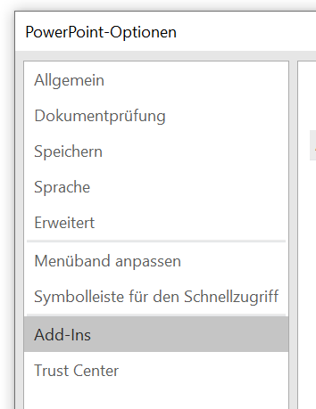
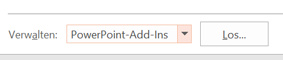
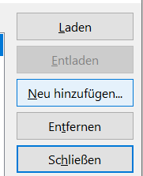
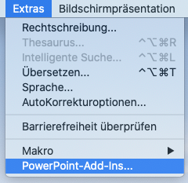
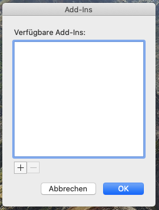
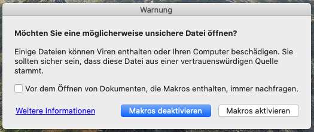

# BKT Legacy-Toolbar

Die Legacy-Toolbar ist der **Vorläufer der [BKT](README.md)**. Sie ist in VBA geschrieben und hat daher diverse Einschränkungen im Vergleich zur BKT. Es findet **keine weitere Entwicklung neuer Funktionen** statt; lediglich Bugfix-Releases sind vorgesehen. Der Vorteil von VBA ist jedoch, dass die Toolbar **größtenteils auch unter Mac** funktioniert. Ein detaillierter [**Vergleich** der BKT mit der Legacy-Toolbar ist hier](comparison.md).

Wie auch für die BKT gibt es für die Legacy-Toolbar keinen Support.

## Systemvoraussetzungen

Die Legacy-Toolbar läuft unter Windows ab Office 2010 und unter Mac ab Office 2016. Einige Funktionen sind auf Mac nicht verfügbar.

## Installation

Die Legacy-Toolbar kann als **[kompiliertes Addin (ppam-Datei)](https://github.com/pyro-team/bkt-legacy/releases/latest) heruntergeladen** werden, welche als PowerPoint-Addin eingebunden werden muss. Um die Funktion "Templatefolien einfügen" aus dem Folienmenü zu nutzen, muss außerdem die Datei `Templates.pptx` heruntergeladen und in den gleichen Ordner wie das Addin kopiert werden. Eigene Templates können natürlich ergänzt werden.

### Installation unter Windows

1. Öffnen Sie unter Datei > Optionen die PowerPoint-Optionen und wählen Sie "Add-Ins" im linken Menü. 
1. Wählen Sie unten bei Verwalten im Menü "PowerPoint-Add-Ins" und klicken auf Los. 
1. Nun erscheint ein Fenster mit den aktiven Add-Ins. Entfernen Sie bei Bedarf ältere Versionen des Add-Ins und wählen dann "Neu hinzufügen". Im Datei-Dialog wählen Sie die heruntergeladene Datei (`BKT-Legacy-1.x.x.ppam`) aus. 

### Installation unter Mac

1. Wählen Sie im Menü Extras > PowerPoint-Add-Ins. 
1. Nun erscheint ein Fenster mit den aktiven Add-Ins. Entfernen Sie bei Bedarf ältere Versionen des Add-Ins mit "-" und wählen dann "+" um das Add-In hinzuzufügen. Im Datei-Dialog wählen Sie die heruntergeladene Datei (`BKT-Legacy-1.x.x.ppam`) aus. 
1. In den nun erscheinenden Dialogen müssen Sie Makros aktivieren und ggf. die Sicherheitseinstellungen für dieses Add-In deaktivieren. 