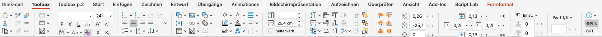
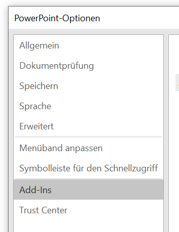
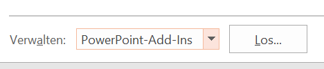
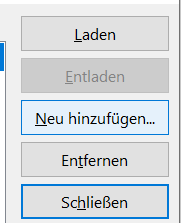
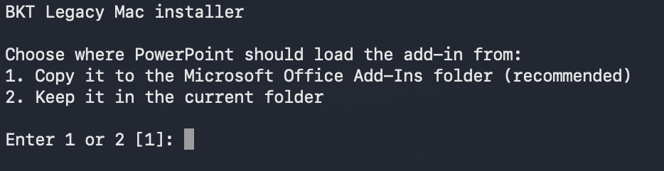
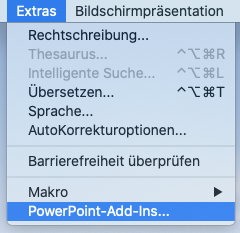
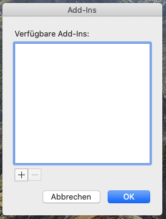
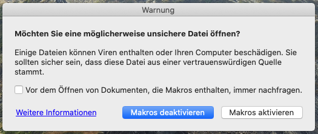

# BKT Legacy-Toolbar

Die Legacy-Toolbar ist eine einfache **Toolbar für PowerPoint** und der **Vorläufer der [BKT](README.md)**. Die Toolbar ist in VBA geschrieben und hat daher diverse Einschränkungen im [Vergleich zur BKT](comparison.md), funktioniert dafür jedoch **größtenteils auch unter Mac**. Es findet **keine weitere Entwicklung neuer Funktionen** statt; lediglich Bugfix-Releases sind vorgesehen. Ein detaillierter [**Vergleich** der BKT mit der Legacy-Toolbar ist hier](comparison.md).

Wie auch für die BKT gibt es für die Legacy-Toolbar keinen Support.

## Systemvoraussetzungen

Die Legacy-Toolbar läuft unter Windows ab Office 2010 und unter Mac ab Office 2016. Einige Funktionen sind auf Mac nicht verfügbar.

## Installation

Die Legacy-Toolbar kann für Windows als **[kompiliertes Addin (ppam-Datei)](https://github.com/pyro-team/bkt-legacy/releases/latest)** und für Mac als **[ZIP-Datei mit Installer](https://github.com/pyro-team/bkt-legacy/releases/latest)** heruntergeladen werden. Das Add-In muss anschließend als PowerPoint-Add-In eingebunden werden. Um die Funktion "Templatefolien einfügen" aus dem Folienmenü zu nutzen, muss außerdem die Datei `Templates.pptx` heruntergeladen und in den gleichen Ordner wie das Addin kopiert werden. Eigene Templates können natürlich ergänzt werden. Für die Library-Funktion muss unter Windows und Mac im gleichen Ordner wie das Addin ein Ordner `Library` angelegt werden. Darin können `pptx`-Dateien abgelegt werden; Unterordner werden als Untermenüs angezeigt.

### Installation unter Windows

1. Öffnen Sie unter Datei > Optionen die PowerPoint-Optionen und wählen Sie "Add-Ins" im linken Menü. 
1. Wählen Sie unten bei Verwalten im Menü "PowerPoint-Add-Ins" und klicken auf Los. 
1. Nun erscheint ein Fenster mit den aktiven Add-Ins. Entfernen Sie bei Bedarf ältere Versionen des Add-Ins und wählen dann "Neu hinzufügen". Im Datei-Dialog wählen Sie die heruntergeladene Datei (`BKT-Legacy-1.x.x.ppam`) aus. 

### Installation unter Mac

Die Datei `install.command` installiert zusätzlich ein AppleScript für den Tastaturzugriff über Shortcuts wie Option oder Command. Falls Sie diese Tastatur-Shortcuts nicht verwenden möchten, können Sie das Add-In wie bisher direkt in PowerPoint installieren und mit dem PowerPoint-Add-Ins-Schritt fortfahren.

1. Laden Sie die Datei `BKT-Legacy-mac.zip` von der [Release-Seite](https://github.com/pyro-team/bkt-legacy/releases/latest) herunter und entpacken Sie sie.
1. Führen Sie die enthaltene Datei `install.command` aus. Falls macOS die Ausführung blockiert, öffnen Sie Systemeinstellungen > Datenschutz & Sicherheit und erlauben Sie die Datei mit "Dennoch öffnen". 
1. Bestätigen Sie die erneute Sicherheitsabfrage mit "Dennoch öffnen". Ggf. erscheint anschließend eine Admin-Aufforderung. 
1. Wählen Sie im Terminal den Installationsordner aus.  Der Standardinstallationspfad ist `~/Library/Group Containers/UBF8T346G9.Office/User Content/Add-Ins/BKT-Legacy.ppam`. Ggf. fragt macOS zusätzlich nach Dateizugriff für das Terminal.
1. Wählen Sie in PowerPoint im Menü Extras > PowerPoint-Add-Ins. 
1. Nun erscheint ein Fenster mit den aktiven Add-Ins. Entfernen Sie bei Bedarf ältere Versionen des Add-Ins mit "-" und wählen dann "+" um das Add-In hinzuzufügen. Im Datei-Dialog wählen Sie die installierte Datei `BKT-Legacy.ppam` aus, üblicherweise unter `~/Library/Group Containers/UBF8T346G9.Office/User Content/Add-Ins/BKT-Legacy.ppam`. 
1. In den nun erscheinenden Dialogen müssen Sie Makros aktivieren und ggf. die Sicherheitseinstellungen für dieses Add-In deaktivieren. 
