# Übersicht aller Funktionen

**Tabs/Reiter**

1. [Toolbox 1/3](#toolbox-13)
1. [Toolbox 2/3](#toolbox-23)
1. [Toolbox 3/3](#toolbox-33)
1. [\[BKT\] Harvey Balls](#bkt-harvey-balls)
1. [\[BKT\] Agenda](#bkt-agenda)
1. [\[BKT\] Verknüpfte Shapes](#bkt-verknüpfte-shapes)
1. [Bildtools](#bildtools)
1. [Konsol./Teilen](#konsolteilen)

**Kontextmenüs**

1. [ContextMenuSpell](#contextmenuspell)
1. [ContextMenuShape](#contextmenushape)
1. [ContextMenuTextEdit](#contextmenutextedit)
1. [ContextMenuFrame](#contextmenuframe)
1. [ContextMenuPicture](#contextmenupicture)
1. [ContextMenuObjectsGroup](#contextmenuobjectsgroup)
1. [ContextMenuThumbnail](#contextmenuthumbnail)
1. [ContextMenuShapeConnector](#contextmenushapeconnector)
1. [ContextMenuShapeFreeform](#contextmenushapefreeform)

*Kursiv = Standardfunktionen von PowerPoint*

---

## Toolbox 1/3

### Ablage

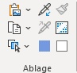

| Name                                               | Beschreibung                                       |
| -------------------------------------------------- | -------------------------------------------------- |
| *Inhalte einfügen...*                              |                                                    |
| Einfügen-Menü                                      | Menü mit verschiedenen Einfüge-Operationen         |
| Einfügen-Menü > *Inhalte einfügen...*              |                                                    |
| Einfügen-Menü > Auf ausgewählte Folien einfügen    | Zwischenablage auf allen ausgewählten Folien gleichzeitig einfügen. |
| Einfügen-Menü > Als Verknüpfung einfügen           | Zwischenablage als verknüpftes Element (bspw. Bild, OLE-Objekt) einfügen. |
| Einfügen-Menü > Mit Zwischenablage ersetzen        | Markiertes Shape mit dem Inhalt der Zwischenablage ersetzen und dabei Größe und Position erhalten. |
| Einfügen-Menü > *Office-Zwischenablage...*         | Zeigen Sie alle in die Zwischenablage kopierten Elemente an. |
| *Kopieren*                                         | Auswählen, wie die Auswahl kopiert werden soll.    |
| Auswahl                                            | Auswahl von Shapes, die dem aktuellem Shape bzgl. Typ/Hintergrund/Rahmen ähneln |
| Auswahl > …mit gleicher Form                       | Selektiere alle Shapes auf dem aktuellen Slide, die die gleiche Form haben wie eine der selektierten Shapes |
| Auswahl > …mit gleichem Hintergrund                | Selektiere alle Shapes auf dem aktuellen Slide, die den gleichen Hintergrund (Farbe) haben wie eine der selektierten Shapes |
| Auswahl > …mit gleichem Rahmen                     | Selektiere alle Shapes auf dem aktuellen Slide, die den gleichen Rahmen (Farbe, Strichtyp) haben wie eine der selektierten Shapes |
| Auswahl > …mit gleicher Schriftfarbe               | Selektiere alle Shapes auf dem aktuellen Slide, die die gleiche Schriftfarbe haben wie eine der selektierten Shapes |
| Auswahl > …mit gleichem Text                       | Selektiere alle Shapes auf dem aktuellen Slide, die den gleichen Text haben wie eine der selektierten Shapes |
| Auswahl > …mit gleicher Größe                      | Selektiere alle Shapes auf dem aktuellen Slide, die die gleiche Größe haben wie eine der selektierten Shapes |
| Auswahl > Benutzerdefinierte Auswahl…              | Öffne einen Dialog zur Auswahl der Shape-Eigenschaften, nach welcher die Shapes auf der aktuellen Folie markiert werden sollen. |
| Auswahl > Überlappend                              | Selektiere alle Shapes auf dem aktuellen Slide, die sich mit einem der selektierten Shapes überlappen. |
| Auswahl > Innerhalb                                | Selektiere alle Shapes auf dem aktuellen Slide, die sich vollständig innerhalb eines der selektierten Shapes befinden. |
| Auswahl > Inner- & oberhalb                        | Selektiere alle Shapes auf dem aktuellen Slide, die sich vollständig innerhalb und oberhalb (d.h. Z-Order ist größer) eines der selektierten Shapes befinden. |
| Auswahl > Inner- & unterhalb                       | Selektiere alle Shapes auf dem aktuellen Slide, die sich vollständig innerhalb und unterhalb (d.h. Z-Order ist kleiner) eines der selektierten Shapes befinden. |
| Auswahl > *Auswahlbereich...*                      | Eine Liste aller Ihrer Objekte anzeigen.  Dies erleichtert das Auswählen von Objekten sowie das Ändern ihrer Reihenfolge oder Sichtbarkeit. |
| Auswahl > Auswahl invertieren                      | Invertiert die aktuelle Auswahl. Es werden alle Shapes (auch Platzhalter) markiert, die vorher nicht markiert waren. |
| *Formatvorlage übernehmen*                         |                                                    |
| *Format kopieren*                                  |                                                    |
| *Format übertragen*                                | Gefällt Ihnen das Aussehen eines bestimmten Abschnitts? Sie können dieses Aussehen auf andere Inhalte im Dokument anwenden.  Und so wird's gemacht: 1. Wählen Sie Inhalt mit der gewünschten Formatierung aus. 2. Klicken Sie auf "Format übertragen". 3. Wählen Sie Inhalt aus, auf den die Formatierung automatisch angewendet werden soll.  Info: Wenn Sie die Formatierung an mehreren Stellen anwenden möchten, doppelklicken Sie auf "Format übertragen". |

### Folien

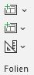

| Name                                               | Beschreibung                                       |
| -------------------------------------------------- | -------------------------------------------------- |
| *Neue Folie*                                       | Ihrer Präsentation eine Folie hinzufügen.          |
| Templatefolie einfügen                             | Aus den hinterlegten Slide-Templates kann ein Template als neue Folie eingefügt werden. |
| Mehr                                               | Agenda, Foliennummerierung, Slidedeck aufräumen, und viele weitere Folien-bezogene Funktionen |
| Mehr > *Layout*                                    | Das Layout Ihrer Folie ändern.                     |
| Mehr > *Folie zurücksetzen*                        | Die Position, Größe und Formatierung der Folienplatzhalter auf die Standardeinstellungen zurücksetzen. |
| Mehr > *Abschnitt*                                 | Ihre Folien in Abschnitte organisieren.            |
| Mehr > Agenda-Textbox einfügen                     | Standard Agenda-Textbox einfügen, um daraus eine aktualisierbare Agenda zu generieren. |
| Mehr > Agenda neu erstellen                        | Neue Agenda auf Basis des aktuellen Slides erstellen. Aktuelles Slide wird Master-Slide der Agenda. |
| Mehr > Agenda aktualisieren                        | Agenda aktualisieren und durch Agenda auf dem Agenda-Master-Slide ersetzen; Folien werden dabei neu erstellt. |
| Mehr > Agenda-Slides für Unterpunkte               | Für Unterpunkte eines Agendapunkts (Indent-Level>1) werden Agenda-Slides erstellt |
| Mehr > Andere Agenda-Unterpunkte ausblenden        | Unterpunkte eines Agendapunkts (Indent-Level>1) werden in den anderen Abschnitten ausgeblendet |
| Mehr > Abschnitte für Agenda-Punkte erstellen      | Einen neuen Abschnitt je Agenda-Folie beginnen.    |
| Mehr > Hyperlinks für Agenda-Punkte erstellen      | Jeden Agenda-Punkt mit der zugehörigen Agenda-Folie verlinken. |
| Mehr > Agenda-Folie entfernen                      | Entfernt Agenda-Folien der gewählten Agenda, alle Meta-Informationen werden gelöscht. |
| Mehr > Alle Agenden aus Präsentation entfernen     | Entfernt alle Agenda-Folien in der ganzen Präsentation, alle Meta-Informationen werden gelöscht. |
| Mehr > Foliennummerierung ein-/ausblenden          | Füge Foliennummerierungen ein, welche sich bei Umsortierung der Folien nicht ändern.  Hilfreich bei der Erfassung von Anmerkungen, wenn man während einer Diskussion des Foliensatzes Umsortierungen durchführt. |
| Mehr > Ausgewählte Folien speichern                | Speichert die ausgewählten Folien in einer neuen Präsentation. |
| Mehr > Ausgewählte Folien senden                   | Sendet die ausgewählten Folien als Email-Anhang.   |
| Mehr > Slidedeck aufräumen                         | Lösche Notizen, ausgebledete Slides, Übergänge, Animationen, Kommentare, doppelte Leerzeichen, leere Platzhalter. |
| Mehr > Slidedeck aufräumen                         | Funktionen zum Aufräumen aller Folien der Präsentation |
| Mehr > Slidedeck aufräumen > Ausgeblendete Slides entfernen | Lösche alle ausgeblendeten Slides im gesamten Foliensatz. |
| Mehr > Slidedeck aufräumen > Notizen entfernen     | Lösche alle Notizen im gesamten Foliensatz.        |
| Mehr > Slidedeck aufräumen > Kommentare entfernen  | Lösche alle Kommentare im gesamten Foliensatz.     |
| Mehr > Slidedeck aufräumen > Autor entfernen       | Autor aus den Dokumenteneigenschaften entfernen.   |
| Mehr > Slidedeck aufräumen > Externe Verknüpfungen entfernen | Hebt den Link von verknüpften Objekten (bspw. Bilder und OLE-Objekten) auf. |
| Mehr > Slidedeck aufräumen > Folienübergänge entfernen | Lösche alle Übergänge zwischen Folien.             |
| Mehr > Slidedeck aufräumen > Shapeanimationen entfernen | Lösche alle Shape-Animationen im gesamten Foliensatz. |
| Mehr > Slidedeck aufräumen > Automatischen Schwarz-/Weiß-Modus deaktivieren | Ersetze den Schwarz-/Weiß-Modus 'Automatisch' durch 'Graustufen'. |
| Mehr > Slidedeck aufräumen > Doppelte Leerzeichen entfernen | Lösche alle doppelten Leerzeichen im gesamten Foliensatz. |
| Mehr > Slidedeck aufräumen > Leere Platzhalter entfernen | Lösche leere Platzhalter-Textboxen im gesamten Foliensatz. |
| Mehr > Slidedeck aufräumen > Nicht genutzte Folienlayouts entfernen | Lösche alle nicht verwendeten Folienmaster-Layouts sowie leere Folienmaster (Designs). |
| Mehr > Slidedeck aufräumen > Nicht genutzte Folienmaster entfernen | Lösche alle nicht verwendeten Folienmaster (Designs). |
| Mehr > Sprache ändern                              | Sprache der Rechtschreibkorrektur für mehrere Shapes, Folien oder die ganze Präsentation anpassen |
| Mehr > Sprache ändern > Deutsch                    | Setze Sprache für ausgewählten Text bzw. alle ausgewählten Shapes. Wenn mehrere Folien ausgewählt sind, werden alle Shapes der gewählten Folien geändert. Wenn nichts ausgewählt ist, werden alle Shapes in der Präsentation sowie die Standardsprache geändert. |
| Mehr > Sprache ändern > US English                 | Setze Sprache für ausgewählten Text bzw. alle ausgewählten Shapes. Wenn mehrere Folien ausgewählt sind, werden alle Shapes der gewählten Folien geändert. Wenn nichts ausgewählt ist, werden alle Shapes in der Präsentation sowie die Standardsprache geändert. |
| Mehr > Sprache ändern > UK English                 | Setze Sprache für ausgewählten Text bzw. alle ausgewählten Shapes. Wenn mehrere Folien ausgewählt sind, werden alle Shapes der gewählten Folien geändert. Wenn nichts ausgewählt ist, werden alle Shapes in der Präsentation sowie die Standardsprache geändert. |
| Mehr > Sprache ändern > Wählbare Sprachen editieren… | Öffnet Dialog um wählbare Sprachen zu ändern.      |
| Mehr > Sprache ändern > *Sprache für die Korrekturhilfen festlegen...* | Wählen Sie die Sprache für den ausgewählten Text aus.  Diese Sprache wir dann in Zukunft immer zum Prüfen der Rechtschreibung und Grammatik verwendet. |
| Mehr > Sprache ändern > *Recht​​​schreibung...*    | Kein Problem, wenn Sie sich mal vertippen - wir passen auf. Lassen Sie Ihre Rechtschreibung prüfen. |
| Mehr > Masteransichten                             | Umschalten auf verschiedene Master-Ansichten       |
| Mehr > Masteransichten > *Folienmaster*            | Masterfolien steuern das Aussehen der gesamten Präsentation, einschließlich Farben, Schriftarten, Hintergründen, Effekten und allen anderen visuellen Aspekten.  Sie können beispielsweise eine Form oder ein Logo auf einem Folienmaster einfügen, und dieses Element wird dann automatisch auf allen Folien angezeigt. |
| Mehr > Masteransichten > *Handzettelmaster*        | Passen Sie an, wie Ihre Präsentation im Ausdruck aussieht.  Sie können das Design und Layout für den Handzettel auswählen, beispielsweise die Hintergrundformatierung und die Stellen, an denen Kopf- und Fußzeilen angezeigt werden sollen. Sie können ferner Optionen für die Seiteneinrichtung auswählen. |
| Mehr > Masteransichten > *Notizenmaster*           | Passen Sie an, wie Ihre Präsentation im Ausdruck mit Notizen aussieht.  Sie können das Design und Layout für die Notizenseite auswählen, beispielsweise die Hintergrundformatierung und die Stellen, an denen Kopf- und Fußzeilen angezeigt werden sollen. Sie können ferner Optionen für die Seiteneinrichtung auswählen. |
| Mehr > Farbe/Graustufen                            | Umschalten auf verschiedene Farbmodi               |
| Mehr > Farbe/Graustufen > *Farbe*                  | Ihre Präsentation ganz in Farbe anzeigen.          |
| Mehr > Farbe/Graustufen > *Graustufe*              | Diese Präsentation in Graustufen anzeigen und anpassen, wie die Farben in Graustufen übersetzt werden. |
| Mehr > Farbe/Graustufen > *Schwarzweiß*            | Diese Präsentation in Schwarzweiß anzeigen und anpassen, wie die Farben in Schwarzweiß übersetzt werden. |
| Mehr > *Führungslinien*                            | Anpassbare Führungslinien anzeigen, an denen Objekte auf der Folie ausgerichtet werden können. |

### Schriftart

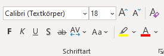

### Absatz

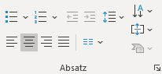

### Formen

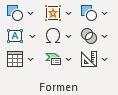

| Name                                               | Beschreibung                                       |
| -------------------------------------------------- | -------------------------------------------------- |
| *Formen*                                           | Fügen Sie vorgefertigte Formen wie Kreise, Quadrate und Pfeile ein. |
| Textfeld zeichnen                                  | Zeichnen Sie ein Textfeld an einer beliebigen Stelle.  Mit gedrückter Umschalt-Taste wird eine unterstrichene Textbox eingefügt.  Mit gedrückter Strg-Taste wird ein Sticker eingefügt. |
| Textfeld zeichnen Menü                             | Sticker einfügen, Bullet Points angleichen, sowie weitere Text-bezogene Funktionen |
| Textfeld zeichnen Menü > *Textfeld*                | Zeichnen Sie an einer beliebigen Stelle ein Textfeld.  Dies ist eine optimale Methode, um genau die gewünschte Textfeldgröße zu erhalten, insbesondere wenn Sie Formen oder Objekten Text hinzufügen. |
| Textfeld zeichnen Menü > Sticker                   | Füge ein Sticker-Shape oben rechts auf dem aktuellen Slide ein. |
| Textfeld zeichnen Menü > Sticker Menü              | Verschiedene Sticker einfügen                      |
| Textfeld zeichnen Menü > Sticker Menü > DRAFT-Sticker | Füge ein Sticker-Shape oben rechts auf dem aktuellen Slide mit Text DRAFT ein. |
| Textfeld zeichnen Menü > Sticker Menü > BACKUP-Sticker | Füge ein Sticker-Shape oben rechts auf dem aktuellen Slide mit Text BACKUP ein. |
| Textfeld zeichnen Menü > Sticker Menü > FOR DISCUSSION-Sticker | Füge ein Sticker-Shape oben rechts auf dem aktuellen Slide mit Text FOR DISCUSSION ein. |
| Textfeld zeichnen Menü > Sticker Menü > ILLUSTRATIVE-Sticker | Füge ein Sticker-Shape oben rechts auf dem aktuellen Slide mit Text ILLUSTRATIVE ein. |
| Textfeld zeichnen Menü > Sticker Menü > CONFIDENTIAL-Sticker | Füge ein Sticker-Shape oben rechts auf dem aktuellen Slide mit Text CONFIDENTIAL ein. |
| Textfeld zeichnen Menü > Sticker Menü > Ausrichtung | Ausrichtungsoptionen für Sticker einstellen        |
| Textfeld zeichnen Menü > Sticker Menü > Ausrichtung > Links | Setzt die Position beim Einfügen der Sticker auf links. |
| Textfeld zeichnen Menü > Sticker Menü > Ausrichtung > Mitte | Setzt die Position beim Einfügen der Sticker auf mittig. |
| Textfeld zeichnen Menü > Sticker Menü > Ausrichtung > Rechts | Setzt die Position beim Einfügen der Sticker auf rechts. |
| Textfeld zeichnen Menü > Sticker Menü > Schriftgröße | Schriftgrößenoptionen für Sticker einstellen       |
| Textfeld zeichnen Menü > Sticker Menü > Schriftgröße > 10 | Setzt die Schriftgröße beim Einfügen der Sticker auf 10 |
| Textfeld zeichnen Menü > Sticker Menü > Schriftgröße > 11 | Setzt die Schriftgröße beim Einfügen der Sticker auf 11 |
| Textfeld zeichnen Menü > Sticker Menü > Schriftgröße > 12 | Setzt die Schriftgröße beim Einfügen der Sticker auf 12 |
| Textfeld zeichnen Menü > Sticker Menü > Schriftgröße > 14 | Setzt die Schriftgröße beim Einfügen der Sticker auf 14 |
| Textfeld zeichnen Menü > Unterstrichene Textbox    | Füge eine Textbox mit Linie unten am Shape auf dem aktuellen Slide ein. |
| Textfeld zeichnen Menü > Aufzählungszeichen korrigieren | Aufzählungszeichen werden korrigiert. Der Stil wird vom Textplatzhalter auf dem Masterslide übernommen. Betrifft: Symbol, Symbol-/Textfarbe, Absatzeinzug/-abstand |
| Textfeld zeichnen Menü > Farbe ändern              | Ändert die Farbe der gewählten Bullet Points.      |
| Textfeld zeichnen Menü > Farbe ändern > Automatisch | Bullet Point Farbe wird automatisch anhand der Textfarbe bestimmt. |
| Textfeld zeichnen Menü > Symbol ändern             | Ändert das Symbol der gewählten Bullet Points.     |
| Textfeld zeichnen Menü > Text in Shape             | Kopiere den Text eines Text-Shapes in das zweite markierte Shape und löscht das Text-Shape. |
| Textfeld zeichnen Menü > Text auf Shape            | Überführe jeweils den Textinhalt der markierten Shapes in ein separates Text-Shape. |
| Textfeld zeichnen Menü > Shape-Text zerlegen       | Zerlege die markierten Shapes anhand der Text-Absätze in mehrere Shapes. Pro Absatz wird ein Shape mit dem entsprechenden Text angelegt. |
| Textfeld zeichnen Menü > Shape-Text zusammenführen | Führe die markierten Shapes in ein Shape zusammen. Der Text aller Shapes wird übernommen und aneinandergehängt. |
| Textfeld zeichnen Menü > Shape-Texte löschen       | Text aller gewählten Shapes löschen.               |
| Textfeld zeichnen Menü > Shape-Texte ersetzen…     | Text aller gewählten Shapes mit im Dialogfeld eingegebenen Text ersetzen. |
| Textfeld zeichnen Menü > Shape-Texte ersetzen Menü | Text mit vordefinierten Standard-Platzhaltern ersetzen |
| Textfeld zeichnen Menü > Shape-Texte ersetzen Menü > … mit »tbd« | Text aller gewählten Shapes mit 'tbd' ersetzen.    |
| Textfeld zeichnen Menü > Shape-Texte ersetzen Menü > … mit Lorem ipsum | Text aller gewählten Shapes mit langem 'Lorem ipsum'-Platzhaltertext ersetzen. |
| Textfeld zeichnen Menü > Shape-Texte ersetzen Menü > … mit Nummerierung | Text aller gewählten Shapes durch Nummerierung ersetzen. |
| Textfeld zeichnen Menü > Shape-Texte ersetzen Menü > … mit benutzerdefiniertem Text | Text aller gewählten Shapes mit im Dialogfeld eingegebenen Text ersetzen. |
| Tabelle einfügen                                   | Einfügen von Standard- oder Shape-Tabellen         |
| Tabelle einfügen > *Tabelle*                       | Eine Tabelle ist eine komfortable Methode, um Informationen innerhalb Ihres Dokuments zu organisieren. |
| Tabelle einfügen > Shape-Tabelle einfügen          | Füge eine Tabelle aus Standard-Shapes ein          |
| Tabelle einfügen > Shape-Tabelle einfügen > Ohne Abstand | Abstand bei Shape-Tabelle deaktivieren             |
| Tabelle einfügen > Shape-Tabelle einfügen > Kleiner Abstand | Abstand bei Shape-Tabelle auf klein setzen         |
| Tabelle einfügen > Shape-Tabelle einfügen > Großer Abstand | Abstand bei Shape-Tabelle auf groß setzen          |
| Tabelle einfügen > Shape-Schachbrett einfügen      | Füge ein Schachbrett aus Standard-Shapes ein       |
| Tabelle einfügen > Shape-Schachbrett einfügen > Ohne Abstand | Abstand bei Shape-Tabelle deaktivieren             |
| Tabelle einfügen > Shape-Schachbrett einfügen > Kleiner Abstand | Abstand bei Shape-Tabelle auf klein setzen         |
| Tabelle einfügen > Shape-Schachbrett einfügen > Großer Abstand | Abstand bei Shape-Tabelle auf groß setzen          |
| Personal Shape Library                             | Aus den hinterlegten Shape-Templates kann ein Shape auf die aktuelle Folie eingefügt werden. |
| Symbol-Menü                                        | Öffnet ein Menü mit verschiedenen Gallerien zum schnellen Einfügen von Symbolen und speziellen Zeichen. |
| Symbol-Menü > *Symbol...*                          | Symbole hinzufügen, die nicht auf der Tastatur vorhanden sind.  Sie haben verschiedene Auswahlmöglichkeiten, einschließlich mathematischer, Währungs- und Copyrightsymbole. |
| Symbol-Menü > Geschützter Trennstrich              | Ein geschützter Trennstrich ist ein Symbol zur optionalen Silbentrennung. Der Trennstrich erscheint nur am Zeilenende und bleibt sonst unsichtbar. |
| Symbol-Menü > Geschütztes Leerzeichen              | Ein geschütztes Leerzeichen erlaubt keinen Zeilenumbruch. |
| Symbol-Menü > Schmales geschütztes Leerzeichen     | Ein schmales geschütztes Leerzeichen erlaubt keinen Zeilenumbruch und ist bspw. zwischen Buchstaben von Abkürzungen zu verwenden. |
| Symbol-Menü > Typografiesymbole                    | Verschiedene Typografiesymbole einfügen            |
| Symbol-Menü > Mathesymbole                         | Verschiedene Mathesymbole einfügen                 |
| Symbol-Menü > Listensymbole                        | Verschiedene Listensymbole einfügen                |
| Symbol-Menü > Pfeile                               | Verschiedene Pfeile einfügen                       |
| Symbol-Menü > Icon-Fonts                           | Zeigt Icons für verfügbare Icon-Fonts an, die als Textsymbol oder Grafik eingefügt werden können.  Hinweis: Die Icon-Fonts müssen auf dem Rechner installiert sein. |
| Symbol-Menü > Unicode-Schriftart wählen            | Unicode-Zeichen können entweder mit der Standard-Schriftart oder einer speziellen Unicode-Schriftart eingefügt werden. Diese kann hier ausgewählt werden. |
| Symbol-Menü > Unicode-Schriftart wählen > Theme-Schriftart (Standard) | Es wird keine spezielle Unicode-Schriftart verwendet, sondern die Standard-Schriftart des Themes. |
| Symbol-Menü > Unicode-Schriftart wählen > Arial    | Arial als Unicode-Schriftart verwenden.            |
| Symbol-Menü > Unicode-Schriftart wählen > Arial Unicode MS | Arial Unicode MS als Unicode-Schriftart verwenden. |
| Symbol-Menü > Unicode-Schriftart wählen > Calibri  | Calibri als Unicode-Schriftart verwenden.          |
| Symbol-Menü > Unicode-Schriftart wählen > Lucida Sans Unicode | Lucida Sans Unicode als Unicode-Schriftart verwenden. |
| Symbol-Menü > Unicode-Schriftart wählen > Segoe UI | Segoe UI als Unicode-Schriftart verwenden.         |
| Symbol-Menü > Als Text einfügen (Standard)         | Wenn kein Text ausgewählt und diese Option aktiviert ist, wird das Symbol als Unicode-Zeichen eingefügt. Dies ist der Standard wenn keine Taste gedrückt wird. |
| Symbol-Menü > Als Shapes einfügen [Shift]          | Wenn kein Text ausgewählt und diese Option aktiviert ist, wird das Symbol in ein Shape konvertiert. Dies geht auch bei Klick auf ein Symbol mit gedrückter Shift-Taste. |
| Symbol-Menü > Als Bild einfügen [Strg]             | Wenn kein Text ausgewählt und diese Option aktiviert ist, wird das Symbol als Raster-Grafik eingefügt. Dies geht auch bei Klick auf ein Symbol mit gedrückter Strg-Taste. |
| Spezialformen                                      | Interaktive BKT-Shapes und spezielle zusammengesetzte Shapes einfügen, die sonst nur umständlich zu erstellen sind. |
| Spezialformen > Kreissegmente…                     | Erstelle Kreis mit Segmenten oder Chevrons.        |
| Spezialformen > Agenda-Textbox einfügen            | Standard Agenda-Textbox einfügen, um daraus eine aktualisierbare Agenda zu generieren. |
| Spezialformen > Nummerierung                       | Fügt für jedes markierte Shape ein Nummerierungs-Shape ein. Nummerierung und Styling entsprechend der Auswahl. Markierte Shapes werden entsprechend der Selektions-Reihenfolge durchnummeriert. |
| Spezialformen > Nummerierung > Position links oben | Nummerierungs-Shapes links oben auf dem zugehörigen Shape platzieren |
| Spezialformen > Nummerierung > Position rechts oben | Nummerierungs-Shapes rechts oben auf dem zugehörigen Shape platzieren |
| Spezialformen > Nummerierung > Versetzt positionieren | Standardmäßig werden Nummerierungs-Shapes genau am Rand des zugehörigen Shapes ausgerichtet.  Ist "Versetzt positionieren" aktiviert, werden die Nummerierungs-Shapes etwas weiter außerhalb des zugehörigen Shapes plaziert, so dass der Mittelpunkt des Nummerierungs-Shapes auf der Ecke liegt. |
| Spezialformen > Grafik-Tracker                     | Einen Tracker aus einer Auswahl als Bild erstellen, verteilen und ausrichten. |
| Spezialformen > Grafik-Tracker > Tracker aus Auswahl erstellen | Erstelle aus den markierten Shapes einen Tracker. Der Shape-Stil für Highlights wird aus dem zuerst markierten Shape (in der Regel oben links) bestimmt. Der Shape-Stil für alle anderen Shapes wird aus dem als zweites markierten Shape bestimmt. |
| Spezialformen > Grafik-Tracker > Tracker auf Folien verteilen | Verteilen der ausgewählten Tracker auf die Folgefolien und ausrichten. |
| Spezialformen > Grafik-Tracker > Alle Tracker ausrichten | Ausrichten (Position, Größe, Rotation) aller Tracker (auf allen Folien) anhand des ausgewählten Tracker. |
| Spezialformen > Grafik-Tracker > Alle Tracker löschen | Löschen aller Tracker (auf allen Folien) anhand des ausgewählten Tracker. |
| Spezialformen > Prozesspfeile…                     | Erstelle Standard Prozess-Pfeile.                  |
| Spezialformen > Prozessschritt mit Kopfzeile       | Erstelle einen Prozess-Pfeil mit Header-Shape. Das Header-Shape kann im Prozess-Pfeil über Kontext-Menü des Header-Shapes passend angeordnet werden. |
| Spezialformen > 2. Prozessschritt mit Kopfzeile    | Erstelle einen Prozess-Pfeil mit Header-Shape. Das Header-Shape kann im Prozess-Pfeil über Kontext-Menü des Header-Shapes passend angeordnet werden. |
| Spezialformen > Harvey Ball                        | Füge ein Harvey-Ball ein, welcher sich bzgl. Farbe/Füllstand konfigurieren lässt.  Farbe und Füllstand lassen sich über Kontext-Menü und Kontext-Tab konfigurieren, im Tab auch Prozent-Angaben möglich.  Ein Harvey-Ball-Shape ist eine Gruppe aus Kreis- und Torten-Shape. |
| Spezialformen > Ampel                              | Füge eine Status-Ampel ein. Die Status-Farbe der Ampel kann per Kontext-Dialog konfiguriert werden. |
| Spezialformen > Likert-Scale                       | Eine Likert-Scale als Wechselshape einfügen. Über die Wechselshape-Funktionen kann der Füllstand, sowie die Farben verändert werden. |
| Spezialformen > Horizontale Verbindungsfläche      | Erstelle eine horizontale Verbindungsfläche zwischen den vertikalen Seiten (links/rechts) von zwei Shapes. |
| Spezialformen > Vertikale Verbindungsfläche        | Erstelle eine vertikale Verbindungsfläche zwischen den horizontalen Seiten (oben/unten) von zwei Shapes. |
| Spezialformen > Verbindungsfläche neu verbinden    | Aktualisiere die Verbindungsfläche nachdem sich die verbundenen Shapes geändert haben. |
| *Form ändern*                                      | Die Form der Zeichnung ändern, wobei die gesamte Formatierung beibehalten wird. |
| Shape verändern                                    | Funktionen um Shape-Punkte zu manipulieren, Shapes zu duplizieren, und Text in Symbol/Grafik umzuwandeln |
| Shape verändern > Shapes teilen/vervielfachen…     | Shape horizontal/vertikal in mehrere Shapes teilen oder verfielfachen. |
| Shape verändern > *Punkte bearbeiten*              |                                                    |
| Shape verändern > Text/Symbol zu Shapes umwandeln  | Ersetzt den Text einer Textbox in Shapes. Damit kann man bspw. einen Icon-Font in echte Icons umwandeln. |
| Shape verändern > *Vereinigen*                     |                                                    |
| Shape verändern > *Kombinieren*                    |                                                    |
| Shape verändern > *In Einzelmengen zerlegen*       |                                                    |
| Shape verändern > *Schnittmenge bilden*            |                                                    |
| Shape verändern > *Subtrahieren*                   |                                                    |
| Mehr                                               | Standardobjekte (Bilder, Smart-Art, etc.) einfügen, Shapes verstecken und wieder anzeigen, Kopf- und Fußzeile anpassen |
| Mehr > *Bilder...*                                 | Fügen Sie Bilder von Ihrem Computer oder von anderen Computern ein, mit denen eine Verbindung besteht. |
| Mehr > *Objekt...*                                 | Eingebettete Objekte sind Dokumente oder andere Dateien, die Sie in dieses Dokument eingefügt haben. Statt mit gesonderten Dateien zu arbeiten, ist es manchmal einfacher, alle eingebettet in einem Dokument zu verwenden. |
| Mehr > *Onlinebilder...*                           | Suchen Sie Bilder in einer Vielzahl von Onlinequellen, und fügen Sie diese dann ein. |
| Mehr > *SmartArt...*                               | Fügen Sie eine SmartArt-Grafik ein, um Informationen grafisch zu veranschaulichen.  SmartArt-Grafiken reichen von grafischen Listen und Prozessdiagrammen bis hin zu komplexeren Grafiken, wie z. B. Venn-Diagrammen oder Organigrammen. |
| Mehr > *Diagramm...*                               | Erleichtern Sie das Erkennen von Mustern und Trends in Ihren Daten, indem Sie ein Balken-, Flächen- oder Liniendiagramm einfügen. |
| Mehr > *Kopf- und Fußzeile...*                     | Der Inhalt der Kopf- und Fußzeilen wird am oberen bzw. unteren Rand jeder gedruckten Seite wiederholt.  Diese Funktion ist nützlich, um Informationen wie Dateiname, Datum und Uhrzeit hervorzuheben. |
| Mehr > *Datum und Uhrzeit...*                      | Das aktuelle Datum oder die aktuelle Uhrzeit schnell hinzufügen. |
| Mehr > *Zahl...*                                   | Die Folien in der Präsentation nummerieren, um das Verweisen zu erleichtern.  Sie können die Foliennummer auch hinzufügen, indem Sie zuerst in ein Textfeld und dann auf "Foliennummer" klicken. |
| Mehr > *Kommentar*                                 | Fügen Sie einen Kommentar zu diesem Teil des Dokuments hinzu. |
| Mehr > Shapes verstecken                           | Verstecke alle markierten Shapes (visible=False).  |
| Mehr > Versteckte Shapes einblenden                | Mache alle versteckten Shapes (visible=False) wieder sichtbar. |

### Stile

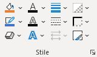

| Name                                               | Beschreibung                                       |
| -------------------------------------------------- | -------------------------------------------------- |
| *Fülleffekt*                                       | Füllen Sie die ausgewählte Form mit einer Volltonfarbe, einem Farbverlauf, einem Bild oder einer Textur. |
| *Bildrahmen*                                       | Wählen Sie die Farbe, Stärke und Art der Linie für die Kontur Ihrer Form aus. |
| *Formeffekte*                                      | Wenden Sie einen Grafikeffekt auf die ausgewählte Form an, z. B. einen Schatten, einen Leuchteffekt, eine Spiegelung oder eine 3D-Drehung. |
| *Textfüllung*                                      | Füllen Sie den Text mit einer Volltonfarbe, einem Farbverlauf, einem Bild oder einer Textur. |
| *Textkontur*                                       | Passen Sie die Kontur Ihres Texts an, indem Sie Farbe, Breite und Linienart auswählen. |
| *Texteffekte*                                      | Verwandeln Sie Ihr Werk in ein Kunstwerk.  Fügen Sie Ihrem Text einen Grafikeffekt hinzu, beispielsweise einen Schatten, einen Leuchteffekt oder eine Spiegelung. |
| *Stärke*                                           | Die Breite des Rahmens oder der Kontur auswählen.  |
| *Striche*                                          | Wählen Sie eine Linienart für den Rahmen und die Kontur aus. |
| *Pfeile*                                           |                                                    |
| Transparenz Hintergrund                            | Setzt die Hintergrund-Transparenz auf den gewählten Wert. |
| Transparenz Linie/Rahmen                           | Setzt die Linien-Transparenz auf den gewählten Wert. |
| Styles anzeigen                                    | Zeigt Übersicht über alle Custom-Styles im aktuellen Katalog. |
| Styles anzeigen > Neuen Style aufnehmen            | Nimmt Format vom gewählten Shape neu in die Gallerie auf. |
| Styles anzeigen > [STRG]+Klick für Bearbeiten und Löschen | Bei Klick auf ein Custom-Style mit gedrückter STRG-Taste öffnet sich ein Fenster zur Bearbeitung und Löschung dieses Styles. |
| Styles anzeigen > [SHIFT]+Klick für Anlage neues Shape | Bei Klick auf ein Custom-Style mit gedrückter SHIFT-Taste wird immer ein neues Shapes in gewähltem Style angelegt. |
| Styles anzeigen > Einschränkungen durch PowerPoint-Bugs | Liste von funktionalen Einschränkungen durch interne PowerPoint-Bugs anzeigen |

### Größe

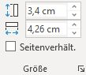

| Name                                               | Beschreibung                                       |
| -------------------------------------------------- | -------------------------------------------------- |
| *Höhe:*                                            | Die Höhe der Form oder des Bilds ändern.           |
| *Breite:*                                          | Die Breite der Form oder des Bilds ändern.         |

### Anordnen

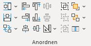

| Name                                               | Beschreibung                                       |
| -------------------------------------------------- | -------------------------------------------------- |
| Gleiche Höhe                                       | Normiere die Höhe der markierten Shapes, entsprechend der Höhe des höchsten Shapes. Bei gedrückter Shift-Taste entsprechend des niedrigsten Shapes. Bei gedrückter Strg-Taste entsprechend des zuletzt markierten Shapes. |
| Gleiche Höhe Menü                                  | Mehrere Shapes auf verschiedene Weise auf die gleiche Höhe setzen |
| Gleiche Höhe Menü > Gleiche Höhe wie höchstes Shape | Normiere die Höhe der markierten Shapes, entsprechend der Höhe des höchsten Shapes. |
| Gleiche Höhe Menü > Gleiche Höhe wie niedrigstes Shape [Shift] | Normiere die Höhe der markierten Shapes, entsprechend der Höhe des niedrigsten Shapes. |
| Gleiche Höhe Menü > Gleiche Höhe wie Median der Shape-Höhen | Normiere die Höhe der markierten Shapes, entsprechend des Medians der Höhen der Shapes. |
| Gleiche Höhe Menü > Gleiche Höhe wie Mittelwert der Shape-Höhen | Normiere die Höhe der markierten Shapes, entsprechend des Mittelwers der Höhen der Shapes. |
| Gleiche Höhe Menü > Gleiche Höhe wie Master-Shape [Strg] | Normiere die Höhe der markierten Shapes, entsprechend der Höhe des Master-Shapes (also zuletzt bzw. zuerst markiertes Shape). |
| Gleiche Breite                                     | Normiere die Breite der markierten Shapes, entsprechend der Breite des breitesten Shapes. Bei gedrückter Shift-Taste entsprechend des schmalsten Shapes. Bei gedrückter Strg-Taste entsprechend des zuletzt markierten Shapes. |
| Gleiche Breite Menü                                | Mehrere Shapes auf verschiedene Weise auf die gleiche Breite setzen |
| Gleiche Breite Menü > Gleiche Breite wie breitestes Shape | Normiere die Breite der markierten Shapes, entsprechend der Breite des breitesten Shapes. |
| Gleiche Breite Menü > Gleiche Breite wie schmalstes Shape [Shift] | Normiere die Breite der markierten Shapes, entsprechend der Breite des schmalsten Shapes. |
| Gleiche Breite Menü > Gleiche Breite wie Median der Shape-Breiten | Normiere die Breite der markierten Shapes, entsprechend des Medians der Breiten der Shapes. |
| Gleiche Breite Menü > Gleiche Breite wie Mittelwert der Shape-Breiten | Normiere die Breite der markierten Shapes, entsprechend des Mittelwerts der Breiten der Shapes. |
| Gleiche Breite Menü > Gleiche Breite wie Master-Shape [Strg] | Normiere die Breite der markierten Shapes, entsprechend der Breite des Master-Shapes (also zuletzt bzw. zuerst markiertes Shape). |
| Tauschen                                           | Tausche die Position (left/top) der markierten Shapes. |
| Tauschen Menü                                      | Funktionen zum Tauschen von Shape-Position, -Größe oder Formatierung |
| Tauschen Menü > Tausche Position                   | Tausche die Position (left/top) der markierten Shapes. |
| Tauschen Menü > Tausche Position und Größe [Shift] | Tausche die Position (left/top) und Größe der markierten Shapes. |
| Tauschen Menü > Ankerpunkt beim Tauschen           | Legt den Punkt fest, der beim Tauschen der Shapes fixiert sein soll. |
| Tauschen Menü > Tausche x-Position                 | Tausche die x-Position (Abstand vom linken Folienrand) der markierten Shapes. |
| Tauschen Menü > Tausche y-Position                 | Tausche die y-Position (Abstand vom oberen Folienrand) der markierten Shapes. |
| Tauschen Menü > Tausche Z-Order                    | Tausche die Z-Order-Position der markierten Shapes. |
| Tauschen Menü > Tausche Formatierung               | Tausche die Formatierung (Farbe, Rahmen, Schrift, ...) der markierten Shapes. |
| Tauschen Menü > Ersetzen und Größe erhalten        | Zuletzt gewähltes Shape mit zuerst gewähltem Shape ersetzen und dabei die Größe vom Original-Shape erhalten. |
| *Linksbündig*                                      |                                                    |
| *Rechtsbündig*                                     |                                                    |
| *Horizontal zentrieren*                            |                                                    |
| *Oben ausrichten*                                  |                                                    |
| *Unten ausrichten*                                 |                                                    |
| *Vertikal zentrieren*                              |                                                    |
| *Horizontal verteilen*                             |                                                    |
| *Vertikal verteilen*                               |                                                    |
| Mehr                                               | Funktionen wie Positionierung, Verlinkte Shapes, ... |
| Mehr > *Drehen*                                    | Drehen oder spiegeln Sie das ausgewählte Objekt.   |
| Mehr > Shapes positionieren                        | Positioniere die ausgewählten Shapes auf eine Standardposition. |
| Mehr > Shapes positionieren > Benutzerdef. Bereich festlegen | Der benutzerdefinierte Bereich wird anhand des gewählten Shapes festgelegt. Dieser Bereich ist anschließend über die Gallery wählbar und wird dauerhaft in der aktuellen Prästentation vorgehalten. |
| Mehr > Dimensionen/Größen übertragen               | Dimensionen von Diagrammen, Bild-Ausschnitten und Tabellen von einem Objekt auf ein anderes kopieren |
| Mehr > Dimensionen/Größen übertragen > Diagramm-Dimensionen kopieren | Kopiert Höhe und Breite des Diagramms sowie Größe und Position der Zeichnungsfläche, um ein anderes Diagramm anzugleichen. |
| Mehr > Dimensionen/Größen übertragen > Diagramm-Dimensionen einfügen | Überträgt die kopierte Größe und Position des Diagramms bzw. der Zeichnungsfläche auf das ausgewählte Diagramm. |
| Mehr > Dimensionen/Größen übertragen > Bild-Zuschnitt kopieren | Kopiert Höhe und Breite des Ausschnitts bei einem zugeschnittenen Bild, um den Ausschnitt mit einem anderen Bild anzugleichen. |
| Mehr > Dimensionen/Größen übertragen > Bild-Zuschnitt einfügen | Überträgt die kopierte Größe und Position des Bilde-Ausschnitts auf das ausgewählte Bild. |
| Mehr > Dimensionen/Größen übertragen > Tabellengrößen kopieren | Kopiert Höhe und Breite der Tabellenzeilen bzw. Tabellenspalten, um diese mit einer anderen Tabelle anzugleichen. |
| Mehr > Dimensionen/Größen übertragen > Tabellengrößen einfügen | Überträgt die kopierten Tabellen-Dimensionen auf die ausgewählte Tabelle. |
| Mehr > Kanten-Autofixer                            | Gleicht minimale Verschiebungen der Kanten der gewählten Shapes aus. |
| Mehr > Kanten-Autofixer Menü                       | Einstellungsmöglichkeiten für den Kanten-Autofixer |
| Mehr > Kanten-Autofixer Menü > Kanten-Autofixer diagonal von links-oben | Gleicht minimale Verschiebungen der Kanten der gewählten Shapes aus durch Vergrößerung auf Shapes links-oberhalb der anzupassenden Shapes. |
| Mehr > Kanten-Autofixer Menü > Kanten-Autofixer von oben nach unten | Gleicht minimale Verschiebungen der Kanten der gewählten Shapes aus durch Vergrößerung auf Shapes links der anzupassenden Shapes. |
| Mehr > Kanten-Autofixer Menü > Kanten-Autofixer von links nach rechts | Gleicht minimale Verschiebungen der Kanten der gewählten Shapes aus durch Vergrößerung auf Shapes oberhalb der anzupassenden Shapes. |
| Mehr > Kanten-Autofixer Menü > Gruppen-Elemente einzeln anpassen | Gibt an ob Elemente einer Gruppe einzeln betrachtet werden, oder die gesamte Gruppe als Ganzes. |
| Mehr > Kanten-Autofixer Menü > Toleranz ändern     | Schwellwert für Kanten-Autofixer anpassen.         |
| Mehr > Kanten-Autofixer Menü > Toleranz ändern > Klein 0,1cm | Setzt Toleranz vom Kanten-Autofixer auf klein = 0,1cm |
| Mehr > Kanten-Autofixer Menü > Toleranz ändern > Mittel 0,3cm | Setzt Toleranz vom Kanten-Autofixer auf mittel = 0,3cm |
| Mehr > Kanten-Autofixer Menü > Toleranz ändern > Groß 1 cm | Setzt Toleranz vom Kanten-Autofixer auf groß = 1cm |
| Mehr > Shape in Mitte positionieren                | Setzt das zuletzt markierte Shape in den gewichteten Mittelpunkt aller anderen markierten Shapes. |
| Mehr > In Gruppe einfügen                          | Sofern das zuerst oder zuletzt markierte Shape eine Gruppe ist, werden alle anderen Shapes in diese Gruppe eingefügt. Anderenfalls werden alle Shapes gruppiert. |
| Mehr > Rekursives Gruppe aufheben                  | Wendet Gruppe aufheben solange an, bis alle verschachtelten Gruppen aufgelöst sind. |
| Mehr > Elemente der Gruppe markieren               | Markiert alle Elemente innerhalb der Gruppe.       |
| Mehr > Shape auf Folgefolien kopieren und verknüpfen… | Dupliziert das aktuelle Shapes auf alle Folien hinter der aktuellen Folie und verknüpft diese für zukünftige Operationen. |
| Mehr > Shape auf Folgefolien suchen und verknüpfen… | Sucht das aktuelle Shape auf allen Folien hinter der aktuellen Folie anhand Position und Größe und verknüpft diese miteinander. |
| Mehr > Ausgewählte Shapes miteinander verknüpfen   | Die ausgewählten Shapes für zukünftige Operationen verknüpfen. Die Verknüpfung bleibt beim Kopieren der Shapes erhalten. |
| Mehr > Bestehende Shape-Verknüpfung erweitern      | Um die bestehende Shape-Verknüpfung zu erweitern, wird die interne ID zwischengespeichert. Über 'Ausgewählte Shapes zur Verknüpfung hinzufügen' können dann weitere Shapes zur Verknüpfung hinzugefügt werden. |
| Mehr > Ausgewählte Shapes zur Verknüpfung hinzufügen | Ausgewählte Shapes zur zwischengespeicherten ID hinzufügen. Vorher muss eine neue Verknüpfung angelegt oder eine bestehende erweitert werden. |
| Mehr > Einzelne Shape-Verknüpfung entfernen        | Entfernt die ID zur Verknüpfung vom aktuellen Shape. Alle anderen Shapes mit der gleichen ID bleiben verknüpft. |
| Mehr > Gesamte Shape-Verknüpfung auflösen          | Entfernt die ID zur Verknüpfung vom aktuellen Shape sowie allen verknüpften Shapes mit der gleichen ID. |
| *Gruppieren*                                       | Verknüpfen Sie Objekte, um sie so zu verschieben und zu formatieren, als wären sie ein einziges Objekt. |
| *Gruppierung aufheben*                             | Heben Sie die Verknüpfung zwischen gruppierten Objekten auf, sodass diese wieder einzeln verschoben werden können. |
| *Gruppierung wiederherstellen*                     |                                                    |
| *In den Vordergrund*                               | Stellen Sie das ausgewählte Objekt vor alle anderen Objekte in den Vordergrund. |
| Vordergrund-Menü                                   | Funktionen um Shapes in den Vordergrund zu holen   |
| Vordergrund-Menü > *In den Vordergrund*            | Stellen Sie das ausgewählte Objekt vor alle anderen Objekte in den Vordergrund. |
| Vordergrund-Menü > *Ebene nach vorne*              | Verschieben Sie das ausgewählte Objekt eine Ebene nach vorne, sodass es von weniger Objekten verdeckt wird. |
| Vordergrund-Menü > Hintere nach vorne              | Bringt alle hinteren Shapes genau vor das vorderste Shape |
| *In den Hintergrund*                               | Stellen Sie das ausgewählte Objekt hinter alle anderen Objekte in den Hintergrund. |
| Hintergrund-Menü                                   | Funktionen um Shapes in den Hintergrund zu setzen  |
| Hintergrund-Menü > *In den Hintergrund*            | Stellen Sie das ausgewählte Objekt hinter alle anderen Objekte in den Hintergrund. |
| Hintergrund-Menü > *Ebene nach hinten*             | Verschieben Sie das ausgewählte Objekt eine Ebene nach hinten, sodass es von mehr Objekten verdeckt wird. |
| Hintergrund-Menü > Vordere nach hinten             | Bringt alle vordere Shapes genau hinter das hinterste Shape |
| Auf Tabelle/Absatz/Shapes anordnen                 | Bei Markierung von Tabellen und Shapes: Ordne jedes Shape, das über einer (ebenfalls selektierten) Tabelle liegt, innerhalb der nächst-liegenden Tabellenzelle an. Die Zelle wird anhand des Shape-Mittelpunkts bestimmt.  Bei Markierung von Shapes: Ordne jedes Shape, das vollständig über einem anderen (ebenfalls selektierten) Shapes (=Mastershape) liegt, in dem nächstliegenden Textabsatz im Mastershape an. Sind weniger as 2 Textabsätze vorhanden, wird innerhalb des gesamten Shapes angeordnet. |
| Auf Tabelle/Absatz/Shapes anordnen Menü            | Einstellungen für das Anordnen auf Tabellen, Absätzen oder Shapes |
| Auf Tabelle/Absatz/Shapes anordnen Menü > Automatisch anordnen | Automatische Auswahl der Anordnungsfunktionen (Tabellenzellen/Absätzen/Shapes) |
| Auf Tabelle/Absatz/Shapes anordnen Menü > Anordnung anpassen | Auswahl der horizontalen und vertikalen Anordnung. |
| Auf Tabelle/Absatz/Shapes anordnen Menü > Auf Tabellenzellen anordnen | Der Mittelpunkt der Shapes muss innerhalb der Tabellenzelle liegen für die automatische Anordnung. |
| Auf Tabelle/Absatz/Shapes anordnen Menü > Auf Text-Absätzen anordnen | Der Mittelpunkt der Shapes muss innerhalb des Text-Shapes und des jeweiligen Absatzes liegen für die automatische Anordnung. |
| Auf Tabelle/Absatz/Shapes anordnen Menü > Auf Hintergrund-Shapes anordnen | Der Mittelpunkt der Shapes muss innerhalb der darunterliegenden Shapes liegen für die automatische Anordnung. |

### Erw. Anordnen

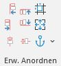

| Name                                               | Beschreibung                                       |
| -------------------------------------------------- | -------------------------------------------------- |
| Links an Links                                     | Ausrichtung der linken Kante an der linken Kante des Mastershapes. (Abstand wird addiert)  Mit SHIFT-Taste wird auf Dehnen/Stauchen umgestellt. |
| Rechts an Rechts                                   | Ausrichtung der rechten Kante an der rechten Kante des Mastershapes. (Abstand wird subtrahiert)  Mit SHIFT-Taste wird auf Dehnen/Stauchen umgestellt. |
| Mitte an Mitte                                     | Ausrichtung der Shapemitte an der Shapemitte des Mastershapes. (kein Abstand)  Mit SHIFT-Taste wird auf Dehnen/Stauchen umgestellt. |
| Oben an Oben                                       | Ausrichtung der oberen Kante an der oberen Kante des Mastershapes. (Abstand wird addiert)  Mit SHIFT-Taste wird auf Dehnen/Stauchen umgestellt. |
| Unten an Unten                                     | Ausrichtung der unteren Kante an der unteren Kante des Mastershapes. (Abstand wird subtrahiert)  Mit SHIFT-Taste wird auf Dehnen/Stauchen umgestellt. |
| Mitte an Mitte                                     | Ausrichtung der Shapemitte an der Shapemitte des Mastershapes. (kein Abstand)  Mit SHIFT-Taste wird auf Dehnen/Stauchen umgestellt. |
| Position                                           | Shapes erhalten die gleiche Position wie das Master-Shape. |
| Größe                                              | Shapes erhalten die gleiche Größe wie das Master-Shape. |
| Master                                             | Bei Aktivierung werden anschließend alle Shapes am selektierten Shape (Mastershape) ausgerichtet. Ist bei Aktivierung kein Shape selektiert, erfolgt die Ausrichtung am Inhaltsbereich. |
| Master-Menü                                        | Festlegen an welchem Referenz-Objekt die Shapes ausgerichtet werden wollen |
| Master-Menü > Automatische Masterwahl              | Macht das zuerst ausgewählte Shape zum Mastershape. Ist kein Shape markiert, wird der Inhaltsbereich als Master verwendet. |
| Master-Menü > …an erstem Shape                     | Shapes werden am zuerst selektierten Shape in der Selektion ausgerichtet. |
| Master-Menü > …an letztem Shape                    | Shapes werden am zuletzt selektierten Shape in der Selektion ausgerichtet. |
| Master-Menü > …an äußerstem Shape (PPT-Standard)   | Shapes werden am äußersten selektierten Shape in der Selektion ausgerichtet. |
| Master-Menü > Indikator an Master-Shape            | Werden mind. zwei Shapes ausgewählt wird ein kleiner Indikator mit dem Text 'Master' an der unteren linken Ecke des Master-Shape (erstes bzw. letztes) angezeigt. |
| Master-Menü > Shape                                | Das selektierten Shape wird als Mastershape festgelegt. Shapes werden am Mastershape ausgerichtet.  |
| Master-Menü > Folie                                | Shapes werden an der Folie ausgerichtet.           |
| Master-Menü > Inhaltsbereich [STRG]                | Shapes werden am Inhaltsbereich ausgerichtet.  Der Inhaltsbereich entspricht der Fläche des Text-Platzhalters auf dem Master-Slide.  Mit STRG-Taste wird dieser Master temporär aktiviert. |
| Master-Menü > Benutzerdef. Bereich                 | Shapes werden an einem festgelegten Bereich ausgerichtet, der zuvor durch den Benutzer definiert wird. |
| Master-Menü > Benutzerdef. Bereich wählen          | Positioniere die ausgewählten Shapes auf eine Standardposition. |
| Master-Menü > Benutzerdef. Bereich wählen > Benutzerdef. Bereich festlegen | Der benutzerdefinierte Bereich wird anhand des gewählten Shapes festgelegt. Dieser Bereich ist anschließend über die Gallery wählbar und wird dauerhaft in der aktuellen Prästentation vorgehalten. |

### Abstand/Rotation

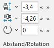

| Name                                               | Beschreibung                                       |
| -------------------------------------------------- | -------------------------------------------------- |
| Vertikalen Objektabstand                           | Ändere den vertikalen Objektabstand auf das angegebene Maß (in cm).  Icon-Klick für 0 Abstand. Shift-Klick für 0,2cm Abstand. Strg-Klick für Abstand angleichen. |
| Objektabstand vertikal                             | Ändere den vertikalen Objektabstand auf das angegebene Maß (in cm).  Icon-Klick für 0 Abstand. Shift-Klick für 0,2cm Abstand. Strg-Klick für Abstand angleichen. |
| Objektabstand vertikal Menü                        | Optionen zur Berechnung des vertikalen Abstands zwischen Shapes |
| Objektabstand vertikal Menü > Shape-Abstand (Standard) | Abstand von unterer Kante zu oberer Kante anzeigen. |
| Objektabstand vertikal Menü > Visueller Abstand (bei Rotation) | Abstand von visueller unterer Kante zu visueller oberer Kante anzeigen. Hilfreich bei rotierten Shapes. |
| Objektabstand vertikal Menü > Abstand zu oberen Kanten | Abstand von oberer Kante zu oberer Kante anzeigen. |
| Objektabstand vertikal Menü > Abstand zu Mittelpunkten | Abstand von den jeweiligen Mittelpunkten anzeigen. |
| Objektabstand vertikal Menü > Abstand zu unteren Kanten | Abstand von unterer Kante zu unterer Kante anzeigen. |
| Objektabstand vertikal Menü > Nach unten           | Ändert die Distanz ausgehend vom obersten Shape und schiebt alle anderen nach unten. Temporärer Wechsel auf 'Nach oben' durch [ALT]. |
| Objektabstand vertikal Menü > Nach oben            | Ändert die Distanz ausgehend vom untersten Shape und schiebt alle anderen nach oben. Temporärer Wechsel auf 'Nach unten' durch [ALT]. |
| Horizontalen Objektabstand                         | Ändere den horizontalen Objektabstand auf das angegebene Maß (in cm).  Icon-Klick für 0 Abstand. Shift-Klick für 0,2cm Abstand. Strg-Klick für Abstand angleichen. |
| Objektabstand horizontal                           | Ändere den horizontalen Objektabstand auf das angegebene Maß (in cm).  Icon-Klick für 0 Abstand. Shift-Klick für 0,2cm Abstand. Strg-Klick für Abstand angleichen. |
| Objektabstand horizontal Menü                      | Optionen zur Berechnung des horizontalen Abstands zwischen Shapes |
| Objektabstand horizontal Menü > Shape-Abstand (Standard) | Abstand von rechter Kante zu linker Kante anzeigen. |
| Objektabstand horizontal Menü > Visueller Abstand (bei Rotation) | Abstand von visueller rechter Kante zu visueller linker Kante. Hilfreich bei rotierten Shapes. |
| Objektabstand horizontal Menü > Abstand zu linken Kanten | Abstand von linker Kante zu linker Kante anzeigen. |
| Objektabstand horizontal Menü > Abstand zu Mittelpunkten | Abstand von den jeweiligen Mittelpunkten anzeigen. |
| Objektabstand horizontal Menü > Abstand zu rechten Kanten | Abstand von rechter Kante zu rechter Kante anzeigen. |
| Objektabstand horizontal Menü > Nach rechts        | Ändert die Distanz ausgehend vom linken Shape und schiebt alle anderen nach rechts. Temporärer Wechsel auf 'Nach links' durch [ALT]. |
| Objektabstand horizontal Menü > Nach links         | Ändert die Distanz ausgehend vom rechten Shape und schiebt alle anderen nach links. Temporärer Wechsel auf 'Nach rechts' durch [ALT]. |
| Form-Rotation                                      | Ändere die Rotation des Shapes auf das angegebene Maß (in Grad).  Icon-Klick für Rotation=0. Shift-Klick für Rotation=180. Strg-Klick für Rotation angleichen. |
| Rotation                                           | Ändere die Rotation des Shapes auf das angegebene Maß (in Grad).  Icon-Klick für Rotation=0. Shift-Klick für Rotation=180. Strg-Klick für Rotation angleichen. |
| Rotation und Spiegelung Menü                       | Shapes rotieren und Spiegelung anzeigen            |
| Rotation und Spiegelung Menü > Ankerpunkt beim Rotieren | Legt den Punkt fest, der beim Rotieren der Shapes fixiert sein soll. |
| Rotation und Spiegelung Menü > Auf 0 Grad setzen   | Shape-Rotation aller gewählten Shapes auf 0 Grad setzen |
| Rotation und Spiegelung Menü > Auf 180 Grad setzen | Shape-Rotation aller gewählten Shapes auf 180 Grad setzen |
| Rotation und Spiegelung Menü > Horizontal gespiegelt an/aus | Aktiviert, wenn das erste gewählte Shape horizontal gespiegelt ist |
| Rotation und Spiegelung Menü > Vertikal gespiegelt an/aus | Aktiviert, wenn das erste gewählte Shape vertikal gespiegelt ist |
| Rotation und Spiegelung Menü > *Weitere Drehungsoptionen...* |                                                    |

### Textfeld Innenabstand

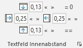

| Name                                               | Beschreibung                                       |
| -------------------------------------------------- | -------------------------------------------------- |
| Innenabstand oben                                  | Ändere den oberen Innenabstand des Textfelds auf das angegebene Maß (in cm). |
| Innenabstand oben                                  | Ändere den oberen Innenabstand des Textfelds auf das angegebene Maß (in cm). |
| = 0                                                | Ändere in Innenabstand des Textfelds an allen Seiten auf Null. |
| Innenabstand links                                 | Ändere den linken Innenabstand des Textfelds auf das angegebene Maß (in cm). |
| Innenabstand links                                 | Ändere den linken Innenabstand des Textfelds auf das angegebene Maß (in cm). |
| Innenabstand rechts                                | Ändere den rechten Innenabstand des Textfelds auf das angegebene Maß (in cm). |
| Innenabstand rechts                                | Ändere den rechten Innenabstand des Textfelds auf das angegebene Maß (in cm). |
| Innenabstand unten                                 | Ändere den unteren Innenabstand des Textfelds auf das angegebene Maß (in cm). |
| Innenabstand unten                                 | Ändere den unteren Innenabstand des Textfelds auf das angegebene Maß (in cm). |
| ==                                                 | Bei Änderung des Textfeld-Innenabstand einer Seite wird der Innenabstand aller Seiten geändert. |

### Absatz

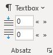

| Name                                               | Beschreibung                                       |
| -------------------------------------------------- | -------------------------------------------------- |
| Textbox                                            | Einstellungen für die Textbox ändern               |
| Textbox > WordWrap                                 | Konfiguriere die Textoption auf 'Text in Form umbrechen'. |
| Textbox > AutoSize                                 | Konfiguriere die Textoption auf 'Größe der Form dem Text anpassen' bzw. 'Größe nicht automatisch anpassen'. |
| Textbox > *Weitere Optionen...*                    |                                                    |
| Absatzabstand oben                                 | Ändere den Absatzabstand vor dem Absatz auf das angegebene Maß (entweder in Abstand Zeilen oder in pt). |
| Absatzabstand unten                                | Ändere den Absatzabstand hinter dem Absatz auf das angegebene Maß (entweder in Abstand Zeilen oder in pt). |

### Fine-Tuning

| Name                                               | Beschreibung                                       |
| -------------------------------------------------- | -------------------------------------------------- |
| <                                                  | Springe zu vorheriger Seite für die Anfasser-Werte. |
| Anfasser-Werte wechseln                            | Anfasser beeinflussen die Shape-Form, bspw. die Rundung an Ecken oder die Spitze von Pfeilen. Je nach Shape-Typ kann es bis zu 8 Anfasser-Werte geben, die manuell gesetzt werden können. Hier kann paarweise zwischen den Werten umgeschaltet werden. |
| Anfasser-Werte wechseln > Werte 1 und 2            | Anfasser-Werte Nr. 1 und 2 in Spinner-Boxen anpassen |
| Anfasser-Werte wechseln > Werte 3 und 4            | Anfasser-Werte Nr. 3 und 4 in Spinner-Boxen anpassen |
| Anfasser-Werte wechseln > Werte 5 und 6            | Anfasser-Werte Nr. 5 und 6 in Spinner-Boxen anpassen |
| Anfasser-Werte wechseln > Werte 7 und 8            | Anfasser-Werte Nr. 7 und 8 in Spinner-Boxen anpassen |
| Anfasser-Werte wechseln > Alle Shapes angleichen   | Shape-Anfasser-Werte für alle ausgewählten Shapes entsprechend des zuerst gewählten Shapes angleichen |
| Anfasser-Werte wechseln > Shape-Details anzeigen   | Zeigt ein Fenster mit ausführlichen Informationen über das gewählte Shape an |
| >                                                  | Springe zu nächsten Seite für die Anfasser-Werte.  |
| Anfasser 1                                         | Ändere die Breite von Rundungen (bspw. abgerundetes Rechteck), Pfeilspitzen (bspw. Richtungspfeil) oder Ecken (bspw. abgeschnittenes Rechteck) auf das angegebene Maß (je nach Shape-Typ in cm oder %). |
| Anfasser 2                                         | Ändere die Breite von Rundungen (bspw. abgerundetes Rechteck), Pfeilspitzen (bspw. Richtungspfeil) oder Ecken (bspw. abgeschnittenes Rechteck) auf das angegebene Maß (je nach Shape-Typ in cm oder %). |

### Settings

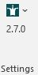

| Name                                               | Beschreibung                                       |
| -------------------------------------------------- | -------------------------------------------------- |
| Settings                                           | BKT-Einstellungen verwalten, BKT neu laden, Website aufrufen, etc. |
| Settings > Website: bkt-toolbox.de                 | BKT-Webseite im Browser öffnen                     |
| Settings > BKT r20-03-13 v2.7.0                    | Erweiterte Versionsinformationen anzeigen          |
| Settings > Auf neue Version prüfen                 | Überprüfen, ob neue BKT-Version verfügbar ist      |
| Settings > Feature-Ordner                          | Feature-Ordner hinzufügen oder entfernen           |
| Settings > Addin neu laden                         | BKT-Addin beenden und neu laden (ähnlich PowerPoint-Neustart) |
| Settings > Ribbon aktualisieren                    | Oberfläche aktualisieren und alle Werte neu laden (sog. Invalidate ausführen) |
| Settings > Öffne BKT-Ordner                        | Öffne Ordner mit BKT-Framework und Konfigurationsdatei |
| Settings > Öffne config.txt                        | Öffne Konfigurationsdatei im Standardeditor        |
| Settings > Key-/Mouse-Hooks an/aus                 | Tastatur-/Maus-Events für aktuelle Sitzung ein- oder ausschalten |
| Settings > Format-Tab ausblenden                   | Format-Tab wird ausgeblendet, um automatischen Wechsel zum Tab beim Anlegen von Shapes zu verhindern. |
| Settings > Popup-Dialog deaktivieren               | Deaktiviert die Popup-Dialoge von BKT-Shapes wie Harvey-Balls, verknüpfte Shapes, etc. |
| Settings > UI Theme                                | Tabs und Gruppen der PowerPoint-Toolbox auf individuelle Bedürfnisse anpassen |
| Settings > UI Theme > Standard (3-seitig)          | Drei Tabs für die Toolbox mit allen erweiterten Features auf einer separaten Seite 3 |
| Settings > UI Theme > Widescreen (2-seitig)        | Zwei Tabs für die Toolbox mit allen erweiterten Features gemeinsam auf Seite 2. |
| Settings > UI Theme > Theme-Einstellungen          | Festlegung der Seite je Gruppe und Ausblenden von Gruppen. |
| 2.7.0                                              | Powerpoint Toolbox v2.7.0 BKT r20-03-13         |
| BKT Warning                                        | At least one open presentation in protected view detected. Unexpected PowerPoint behavior may occur. |

## Toolbox 2/3

### Position/Größe

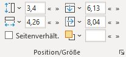

| Name                                               | Beschreibung                                       |
| -------------------------------------------------- | -------------------------------------------------- |
| Höhe                                               | Änderung der Höhe.  Bei gedrückter STRG-Taste Veränderung um 0,1 cm statt 0,2 cm.  Bei gedrückter ALT-Taste Veränderung relativ je Shape (wenn mehrere Shapes ausgewählt sind). |
| Höhe                                               | Änderung der Höhe.  Bei gedrückter STRG-Taste Veränderung um 0,1 cm statt 0,2 cm.  Bei gedrückter ALT-Taste Veränderung relativ je Shape (wenn mehrere Shapes ausgewählt sind). |
| Höhe > Visuelle Größe                              | Visuelle Größe unter Berücksichtigung der Rotation verwenden |
| Höhe > Höhe = Breite                               | Setzt die Höhe gleich der Breite unter Berücksichtigung des Fixpunkts. Ist das Seitenverhältnis gesperrt, wird dies temporär aufgehoben. |
| Höhe > Höhe ⇄ Breite                               | Tauscht die Höhe mit der Breite unter Berücksichtigung des Fixpunkts |
| Breite                                             | Änderung der Breite.  Bei gedrückter STRG-Taste Veränderung um 0,1 cm statt 0,2 cm.  Bei gedrückter ALT-Taste Veränderung relativ je Shape (wenn mehrere Shapes ausgewählt sind). |
| Breite                                             | Änderung der Breite.  Bei gedrückter STRG-Taste Veränderung um 0,1 cm statt 0,2 cm.  Bei gedrückter ALT-Taste Veränderung relativ je Shape (wenn mehrere Shapes ausgewählt sind). |
| Breite > Visuelle Größe                            | Visuelle Größe unter Berücksichtigung der Rotation verwenden |
| Breite > Breite = Höhe                             | Setzt die Breite gleich der Höhe unter Berücksichtigung des Fixpunkts. Ist das Seitenverhältnis gesperrt, wird dies temporär aufgehoben. |
| Breite > Breite ⇄ Höhe                             | Tauscht die Breite mit der Höhe unter Berücksichtigung des Fixpunkts |
| Position von oben                                  | Änderung der Position von oben.  Bei gedrückter STRG-Taste Veränderung um 0,1 cm statt 0,2 cm.  Bei gedrückter ALT-Taste Veränderung relativ je Shape (wenn mehrere Shapes ausgewählt sind). |
| Position von oben                                  | Änderung der Position von oben.  Bei gedrückter STRG-Taste Veränderung um 0,1 cm statt 0,2 cm.  Bei gedrückter ALT-Taste Veränderung relativ je Shape (wenn mehrere Shapes ausgewählt sind). |
| Position von oben > Visuelle Position              | Visuelle Position unter Berücksichtigung der Rotation verwenden |
| Position von oben > Oben = Links                   | Setzt die obere Kante gleich der linken Kante unter Berücksichtigung des Fixpunkts |
| Position von oben > Oben ⇄ Links                   | Tauscht die obere Kante mit der linken Kante unter Berücksichtigung des Fixpunkts |
| Position von links                                 | Änderung der Position von links.  Bei gedrückter STRG-Taste Veränderung um 0,1 cm statt 0,2 cm.  Bei gedrückter ALT-Taste Veränderung relativ je Shape (wenn mehrere Shapes ausgewählt sind). |
| Position von links                                 | Änderung der Position von links.  Bei gedrückter STRG-Taste Veränderung um 0,1 cm statt 0,2 cm.  Bei gedrückter ALT-Taste Veränderung relativ je Shape (wenn mehrere Shapes ausgewählt sind). |
| Position von links > Visuelle Position             | Visuelle Position unter Berücksichtigung der Rotation verwenden |
| Position von links > Links = Oben                  | Setzt die linke Kante gleich der oberen Kante unter Berücksichtigung des Fixpunkts |
| Position von links > Links ⇄ Oben                  | Tauscht die linke Kante mit der oberen Kante unter Berücksichtigung des Fixpunkts |
| Z-Order                                            | Änderung der Z-Order, also der Reihenfolge der Shapes auf der Folie. |
| Z-Order                                            | Änderung der Z-Order, also der Reihenfolge der Shapes auf der Folie. |
| Z-Order > *In den Vordergrund*                     | Stellen Sie das ausgewählte Objekt vor alle anderen Objekte in den Vordergrund. |
| Z-Order > *In den Hintergrund*                     | Stellen Sie das ausgewählte Objekt hinter alle anderen Objekte in den Hintergrund. |
| Z-Order > Vordere nach hinten                      | Bringt alle vordere Shapes genau hinter das hinterste Shape |
| Z-Order > Hintere nach vorne                       | Bringt alle hinteren Shapes genau vor das vorderste Shape |

### Erweitertes Anordnen

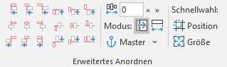

| Name                                               | Beschreibung                                       |
| -------------------------------------------------- | -------------------------------------------------- |
| Links an Links                                     | Ausrichtung der linken Kante an der linken Kante des Mastershapes. (Abstand wird addiert)  Mit SHIFT-Taste wird auf Dehnen/Stauchen umgestellt. |
| Mitte an Links                                     | Ausrichtung der Shapemitte an der linken Kante des Mastershapes. (Abstand wird addiert)  Mit SHIFT-Taste wird auf Dehnen/Stauchen umgestellt. |
| Rechts an Links                                    | Ausrichtung der rechten Kante an der linken Kante des Mastershapes. (Abstand wird subtrahiert)  Mit SHIFT-Taste wird auf Dehnen/Stauchen umgestellt. |
| Links an Mitte                                     | Ausrichtung der linken Kante an der Shapemitte des Mastershapes. (Abstand wird addiert)  Mit SHIFT-Taste wird auf Dehnen/Stauchen umgestellt. |
| Mitte an Mitte                                     | Ausrichtung der Shapemitte an der Shapemitte des Mastershapes. (kein Abstand)  Mit SHIFT-Taste wird auf Dehnen/Stauchen umgestellt. |
| Rechts an Mitte                                    | Ausrichtung der rechten Kante an der Shapemitte des Mastershapes. (Abstand wird subtrahiert)  Mit SHIFT-Taste wird auf Dehnen/Stauchen umgestellt. |
| Links an Rechts                                    | Ausrichtung der linken Kante an der rechten Kante des Mastershapes. (Abstand wird addiert)  Mit SHIFT-Taste wird auf Dehnen/Stauchen umgestellt. |
| Mitte an Rechts                                    | Ausrichtung der Shapemitte an der rechten Kante des Mastershapes. (Abstand wird subtrahiert)  Mit SHIFT-Taste wird auf Dehnen/Stauchen umgestellt. |
| Rechts an Rechts                                   | Ausrichtung der rechten Kante an der rechten Kante des Mastershapes. (Abstand wird subtrahiert)  Mit SHIFT-Taste wird auf Dehnen/Stauchen umgestellt. |
| Oben an oben                                       | Ausrichtung der oberen Kante an der oberen Kante des Mastershapes. (Abstand wird addiert)  Mit SHIFT-Taste wird auf Dehnen/Stauchen umgestellt. |
| Mitte an Oben                                      | Ausrichtung der Shapemitte an der oberen Kante des Mastershapes. (Abstand wird addiert)  Mit SHIFT-Taste wird auf Dehnen/Stauchen umgestellt. |
| Unten an Oben                                      | Ausrichtung der unteren Kante an der oberen Kante des Mastershapes. (Abstand wird subtrahiert)  Mit SHIFT-Taste wird auf Dehnen/Stauchen umgestellt. |
| Oben an Mitte                                      | Ausrichtung der oberen Kante an der Shapemitte des Mastershapes. (Abstand wird addiert)  Mit SHIFT-Taste wird auf Dehnen/Stauchen umgestellt. |
| Mitte an Mitte                                     | Ausrichtung der Shapemitte an der Shapemitte des Mastershapes. (kein Abstand)  Mit SHIFT-Taste wird auf Dehnen/Stauchen umgestellt. |
| Unten an Mitte                                     | Ausrichtung der unteren Kante an der Shapemitte des Mastershapes. (Abstand wird subtrahiert)  Mit SHIFT-Taste wird auf Dehnen/Stauchen umgestellt. |
| Oben an Unten                                      | Ausrichtung der oberen Kante an der unteren Kante des Mastershapes. (Abstand wird addiert)  Mit SHIFT-Taste wird auf Dehnen/Stauchen umgestellt. |
| Mitte an Unten                                     | Ausrichtung der Shapemitte an der unteren Kante des Mastershapes. (Abstand wird subtrahiert)  Mit SHIFT-Taste wird auf Dehnen/Stauchen umgestellt. |
| Unten an Unten                                     | Ausrichtung der unteren Kante an der unteren Kante des Mastershapes. (Abstand wird subtrahiert)  Mit SHIFT-Taste wird auf Dehnen/Stauchen umgestellt. |
| Ausrichtungsabstand                                | Eingestellter Abstand wird bei der Ausrichtung von Shapes links/rechts berücksichtigt.  Der Abstand wird addiert: bei Ausrichtung der linken/oberen Kante (des zu verschiebenden Shapes) und bei Ausrichtung der Shape-Mitte an der linken/oberen Kante des Mastershapes.  Der Abstand wird subtrahiert: bei Ausrichtung der rechten/unteren Kante (des zu verschiebenden Shapes) und bei Ausrichtung der Shape-Mitte an der rechten/unteren Kante des Mastershapes. |
| Bewegen                                            | Gewünschte Shape-Anordnung wird durch Positionierung von Shapes erreicht |
| Dehnen/Stauchen [SHIFT]                            | Gewünschte Shape-Anordnung wird durch Verkleinerung/Vergrößerung von Shapes erreicht |
| Master                                             | Bei Aktivierung werden anschließend alle Shapes am selektierten Shape (Mastershape) ausgerichtet. Ist bei Aktivierung kein Shape selektiert, erfolgt die Ausrichtung am Inhaltsbereich. |
| Master-Menü                                        | Festlegen an welchem Referenz-Objekt die Shapes ausgerichtet werden wollen |
| Master-Menü > Automatische Masterwahl              | Macht das zuerst ausgewählte Shape zum Mastershape. Ist kein Shape markiert, wird der Inhaltsbereich als Master verwendet. |
| Master-Menü > …an erstem Shape                     | Shapes werden am zuerst selektierten Shape in der Selektion ausgerichtet. |
| Master-Menü > …an letztem Shape                    | Shapes werden am zuletzt selektierten Shape in der Selektion ausgerichtet. |
| Master-Menü > …an äußerstem Shape (PPT-Standard)   | Shapes werden am äußersten selektierten Shape in der Selektion ausgerichtet. |
| Master-Menü > Indikator an Master-Shape            | Werden mind. zwei Shapes ausgewählt wird ein kleiner Indikator mit dem Text 'Master' an der unteren linken Ecke des Master-Shape (erstes bzw. letztes) angezeigt. |
| Master-Menü > Shape                                | Das selektierten Shape wird als Mastershape festgelegt. Shapes werden am Mastershape ausgerichtet.  |
| Master-Menü > Folie                                | Shapes werden an der Folie ausgerichtet.           |
| Master-Menü > Inhaltsbereich [STRG]                | Shapes werden am Inhaltsbereich ausgerichtet.  Der Inhaltsbereich entspricht der Fläche des Text-Platzhalters auf dem Master-Slide.  Mit STRG-Taste wird dieser Master temporär aktiviert. |
| Master-Menü > Benutzerdef. Bereich                 | Shapes werden an einem festgelegten Bereich ausgerichtet, der zuvor durch den Benutzer definiert wird. |
| Master-Menü > Benutzerdef. Bereich wählen          | Positioniere die ausgewählten Shapes auf eine Standardposition. |
| Master-Menü > Benutzerdef. Bereich wählen > Benutzerdef. Bereich festlegen | Der benutzerdefinierte Bereich wird anhand des gewählten Shapes festgelegt. Dieser Bereich ist anschließend über die Gallery wählbar und wird dauerhaft in der aktuellen Prästentation vorgehalten. |
| Position                                           | Shapes erhalten die gleiche Position wie das Master-Shape. |
| Größe                                              | Shapes erhalten die gleiche Größe wie das Master-Shape. |

### Einfaches Anordnen

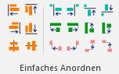

| Name                                               | Beschreibung                                       |
| -------------------------------------------------- | -------------------------------------------------- |
| Links an Links                                     | Ausrichtung der linken Kante an der linken Kante des Mastershapes. |
| Rechts an Rechts                                   | Ausrichtung der rechten Kante an der rechten Kante des Mastershapes. |
| Mitte an Mitte                                     | Ausrichtung der Shapemitte an der Shapemitte des Mastershapes. |
| Oben an oben                                       | Ausrichtung der oberen Kante an der oberen Kante des Mastershapes. |
| Unten an Unten                                     | Ausrichtung der unteren Kante an der unteren Kante des Mastershapes. |
| Mitte an Mitte                                     | Ausrichtung der Shapemitte an der Shapemitte des Mastershapes. |
| Links an Rechts                                    | Ausrichtung der linken Kante an der rechten Kante des Mastershapes. |
| Rechts an Links                                    | Ausrichtung der rechten Kante an der linken Kante des Mastershapes. |
| Unten an Oben                                      | Ausrichtung der unteren Kante an der oberen Kante des Mastershapes. |
| Oben an Unten                                      | Ausrichtung der oberen Kante an der unteren Kante des Mastershapes. |
| Links an Links                                     | Ausrichtung der linken Kante an der linken Kante des Mastershapes. |
| Rechts an Rechts                                   | Ausrichtung der rechten Kante an der rechten Kante des Mastershapes. |
| Oben an oben                                       | Ausrichtung der oberen Kante an der oberen Kante des Mastershapes. |
| Unten an Unten                                     | Ausrichtung der unteren Kante an der unteren Kante des Mastershapes. |
| Links an Rechts                                    | Ausrichtung der linken Kante an der rechten Kante des Mastershapes. |
| Rechts an Links                                    | Ausrichtung der rechten Kante an der linken Kante des Mastershapes. |
| Unten an Oben                                      | Ausrichtung der unteren Kante an der oberen Kante des Mastershapes. |
| Oben an Unten                                      | Ausrichtung der oberen Kante an der unteren Kante des Mastershapes. |

### Erw. Pos.

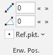

| Name                                               | Beschreibung                                       |
| -------------------------------------------------- | -------------------------------------------------- |
| Objektabstand euklidisch                           | Ändert den euklidischen Objektabstand auf das angegebene Maß (in cm). Gemessen wird jeweils vom definierten Referenzpunkt der beiden zuerst selektierten Shapes.  Mit ALT-Taste wird jedes Shapes im gleichen Delta-Abstand zum ersten Shape ausgerichtet. |
| Winkel                                             | Ändert den Winkel der Shapes zur X-Achse (in Grad). Gemessen wird jeweils vom definierten Referenzpunkt der beiden zuerst selektierten Shapes.  Mit ALT-Taste wird jedes Shapes um den gleichen Delta-Winkel zum ersten Shape verschoben. |
| Ref.pkt.                                           | Referenz- bzw. Ankerpunkte für Distanz und Winkel für erstes Shape und die weitere Shapes festlegen |
| Ref.pkt. > Innerhalb Zentrum-Shape                 | Legt den Punkt innerhalb des Zentrum-Shapes fest, von dem der Abstand bzw. Winkel der Shapes gemessen werden soll. |
| Ref.pkt. > Innerhalb weiterer Shapes               | Legt den Punkt innerhalb aller weiteren Shapes fest, von dem der Abstand bzw. Winkel der Shapes gemessen werden soll. |
| Ref.pkt. > Zentrum-Shape auswählen                 | Legt fest welches Shape innerhalb der Selektion im Zentrum stehen sollen. |
| Ref.pkt. > Zentrum-Shape auswählen > Zuerst selektiertes Shape (Standard) | Legt fest, dass das zuerst selektierte Shape innerhalb der Selektion im Zentrum stehen soll. |
| Ref.pkt. > Zentrum-Shape auswählen > Zuletzt selektiertes Shape | Legt fest, dass das zuletzt selektierte Shape innerhalb der Selektion im Zentrum stehen soll. |
| Ref.pkt. > Verhalten für >2 Shapes                 | Bei Auswahl von mehr als 2 Shapes können unterschiedliche Optionen zur Berechnung zwischen Zentrum-Shape und allen weitere Shapes gewählt werden. |
| Ref.pkt. > Verhalten für >2 Shapes > Abstand/Winkel einzeln vom Zentrum zu Shapes (Standard) | Legt fest, dass Abstand bzw. Winkel für jedes Shape einzeln vom Zentrum zum jeweiligen Shape berechnet wird.  Diese Funktion ist nützlich, um den Winkel einer Diagonalen von Shapes zu ändern oder eine sternförmige Anordnung von Shapes zu erreichen. |
| Ref.pkt. > Verhalten für >2 Shapes > Abstände/Winkel immer um gleiche Differenz ändern [ALT] | Legt fest, dass Abstand bzw. Winkel immer um die gleiche Differenz von Zentrum zum jeweiligen Shape geändert wird.  Temporäre Umschaltung mit ALT-Taste möglich. |
| Ref.pkt. > Verhalten für >2 Shapes > Abstände/Winkel gleichmäßig zwischen Shapes verteilen | Legt fest, dass Abstand bzw. Winkel gleichmäßig von Zentrum und zwischen jedem Shape verteilt wird.  Diese Funktion ist nützlich, um mehrere Shapes entlang einer Diagonalen oder um ein Zentrum herum zu verteilen. |
| Ref.pkt. > Shape-Rotation angleichen               | Passt die Shape-Rotation an den Abstandsvektor bzw. den Winkel an. |

### Absatzeinzug

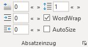

| Name                                               | Beschreibung                                       |
| -------------------------------------------------- | -------------------------------------------------- |
| Einzug 1. Zeile                                    | Ändere den Sondereinzug (1. Zeile, hängend) auf das angegebene Maß (in cm). |
| Einzug links                                       | Ändere den linken Absatzeinzug auf das angegebene Maß (in cm). |
| Einzug rechts                                      | Ändere den rechten Absatzeinzug auf das angegebene Maß (in cm). |
| Zeilenabstand                                      | Ändere den Zeilenabstand (entweder in Abstand Zeilen oder in pt). |

### Format

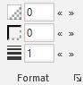

| Name                                               | Beschreibung                                       |
| -------------------------------------------------- | -------------------------------------------------- |
| Transparenz Hintergrund                            | Ändere die Transparenz vom Hintergrund             |
| Transparenz Linie/Rahmen                           | Ändere die Transparenz vom Rahmen bzw. der Linie   |
| Dicke Linie/Rahmen                                 | Ändere die Dicke vom Rahmen bzw. der Linie         |

### Teilen/Vervielfachen

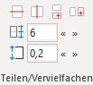

| Name                                               | Beschreibung                                       |
| -------------------------------------------------- | -------------------------------------------------- |
| Horizontal teilen                                  | Shape horizontal in mehrere Shapes teilen, entsprechend der angegebenen Anzahl und mit angegebenem Abstand zwischen den Shapes. |
| Vertikal teilen                                    | Shape vertikal in mehrere Shapes teilen, entsprechend der angegebenen Anzahl und mit angegebenem Abstand zwischen den Shapes. |
| Vertikal vervielfachen                             | Shape mehrfach dublizieren, entsprechend der angegebenen Anzahl. Shapes werden untereinander angeordnet mit dem angegebenem Abstand zwischen den Shapes. |
| Horizontal vervielfachen                           | Shape mehrfach dublizieren, entsprechend der angegebenen Anzahl. Shapes werden nebeneinander angeordnet mit dem angegebenem Abstand zwischen den Shapes. |
| Anzahl Zeilen/Spalten                              | Angestrebte Shapeanzahl für das Teilen/Vervielfachen von Shapes. |
| Zeilen-/Spaltenabstand                             | Abstand zwischen Shapes zur Berücksichtigung beim Teilen/Vervielfachen von Shapes.  Bei Kreisanordnung wird hiermit der vertikale/horizontale Abstand zum Mittelpunkt angegeben. |

### Sprache

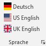

| Name                                               | Beschreibung                                       |
| -------------------------------------------------- | -------------------------------------------------- |
| Deutsch                                            | Setze Sprache für ausgewählten Text bzw. alle ausgewählten Shapes. Wenn mehrere Folien ausgewählt sind, werden alle Shapes der gewählten Folien geändert. Wenn nichts ausgewählt ist, werden alle Shapes in der Präsentation sowie die Standardsprache geändert. |
| US English                                         | Setze Sprache für ausgewählten Text bzw. alle ausgewählten Shapes. Wenn mehrere Folien ausgewählt sind, werden alle Shapes der gewählten Folien geändert. Wenn nichts ausgewählt ist, werden alle Shapes in der Präsentation sowie die Standardsprache geändert. |
| UK English                                         | Setze Sprache für ausgewählten Text bzw. alle ausgewählten Shapes. Wenn mehrere Folien ausgewählt sind, werden alle Shapes der gewählten Folien geändert. Wenn nichts ausgewählt ist, werden alle Shapes in der Präsentation sowie die Standardsprache geändert. |

### Wechsel-Shapes

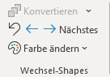

| Name                                               | Beschreibung                                       |
| -------------------------------------------------- | -------------------------------------------------- |
| Konvertieren                                       | Bei gruppierten Shapes (Wechsel-Shapes) kann zwischen den Shapes innerhalb der Gruppe gewechselt werden, d.h. es ist immer nur ein Shape der Gruppe sichtbar. Dies ist bspw. nützlich für Ampeln, Skalen, etc. |
| Wechselshapes-Menü                                 | In Wechselshapes konvertieren oder wieder alle Shapes sichtbar machen |
| Wechselshapes-Menü > In Wechselshape konvertieren  | Bei gruppierten Shapes (Wechsel-Shapes) kann zwischen den Shapes innerhalb der Gruppe gewechselt werden, d.h. es ist immer nur ein Shape der Gruppe sichtbar. Dies ist bspw. nützlich für Ampeln, Skalen, etc. |
| Wechselshapes-Menü > Alle Shapes wieder anzeigen   | Mit diesem Button können die Shapes innerhalb der Wechselshape-Gruppe eingeblendet werden. |
| Zurücksetzen                                       | Setzt alle Wechsel-Shapes auf den ersten Status, d.h. das erste Shape der Gruppe zurück. |
| Vorheriges                                         | Wechselt zum vorherigen Status (d.h. Shape in der Gruppe) des Wechsel-Shapes. |
| Nächstes                                           | Wechselt zum nächsten Status (d.h. Shape in der Gruppe) des Wechsel-Shapes. |
| Farbe ändern                                       | Die Farben von Wechselshapes anpassen              |
| Farbe ändern > Farbe 1 (Hintergrund) ändern        | Passt die Hintergrundfarbe aller Shapes im Wechsel-Shape an. Die Hintergrundfarbe ist die Farbe des zuerst gefundenen Shapes. |
| Farbe ändern > Farbe 1 (Hintergrund) ändern > Kein Hintergrund | Wechsel-Shape Hintergrundfarbe auf transparent setzen |
| Farbe ändern > Farbe 2 (Vordergrund) ändern        | Passt die Vordergrundfarbe aller Shapes im Wechsel-Shape an. Die Vordergrundfarbe ist jede Farbe ungleich der Hintergrundfarbe. |
| Farbe ändern > Linie ändern                        | Passt die Linienfarbe aller Shapes im Wechsel-Shape an, die der ersten gefundenen Linienfarbe entsprechen. |

### Icon-Suche

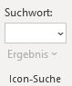

| Name                                               | Beschreibung                                       |
| -------------------------------------------------- | -------------------------------------------------- |
| Suchwort                                           | Suchwort eingeben und ENTER klicken                |
| Suchergebnisse                                     | Zeigt die Suchergebnisse der Icon-Suche nach dem gewünschten Suchwort an |

## Toolbox 3/3

### Folien-Thumbnails

Ermöglicht das Einfügen von aktualisierbaren Folien-Thumbnails. Das Feature `ppt_thumbnails` muss installiert sein.

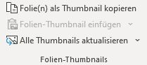

| Name                                               | Beschreibung                                       |
| -------------------------------------------------- | -------------------------------------------------- |
| Folie(n) als Thumbnail kopieren                    | Aktuelle Folie zum Erstellen vom aktualisierbaren Folien-Thumbnails kopieren. |
| Folien-Thumbnail einfügen                          | Kopierte Folie als aktualisierbares Thumbnail mit Referenz auf Originalfolie einfügen.  Ist die Originalfolie aus einer anderen Datei im gleichen Verzeichnis, wird nur der Dateiname hinterlegt, anderenfalls wird der absolute Pfad hinterlegt und die Originaldatei darf nicht verschoben werden. |
| Einfügen-Menü                                      | Einfüge-Optionen für aktualisierbare Folien-Thumbnails |
| Einfügen-Menü > Folien-Thumbnail als PNG einfügen  | Kopierte Folie als aktualisierbares Thumbnail im PNG-Format mit Referenz auf Originalfolie einfügen. |
| Einfügen-Menü > Folien-Thumbnail als Bitmap einfügen | Kopierte Folie als aktualisierbares Thumbnail im Bitmap-Format mit Referenz auf Originalfolie einfügen. |
| Einfügen-Menü > Folien-Thumbnail als Vektor (EMF) einfügen | Kopierte Folie als aktualisierbares Thumbnail im Vektor-Format (Enhanced Metafile) mit Referenz auf Originalfolie einfügen. |
| Alle Thumbnails aktualisieren                      | Alle Folien-Thumbnails auf den ausgewählten Folien aktualisieren. Das Thumbnail muss vorher mit dieser Funktion eingefügt worden sein. Stammt die Folie aus einer anderen Datei, wird diese automatisch kurzzeitig geöffnet. |
| Aktualisieren-Menü                                 | Aktualisierung der Folien-Thumbnails auf dieser Folie oder in der ganzen Präsentation |
| Aktualisieren-Menü > Thumbnails auf Folie/n aktualisieren | Alle Folien-Thumbnails auf den ausgewählten Folien aktualisieren. Das Thumbnail muss vorher mit dieser Funktion eingefügt worden sein. Stammt die Folie aus einer anderen Datei, wird diese automatisch kurzzeitig geöffnet. |
| Aktualisieren-Menü > Thumbnails in Präsentation aktualisieren | Alle Folien-Thumbnails in der Präsentation. Das Thumbnail muss vorher mit dieser Funktion eingefügt worden sein. Stammt die Folie aus einer anderen Datei, wird diese automatisch kurzzeitig geöffnet. |

### Notes

Ermöglicht das Einfügen von Bearbeitungsnotizen auf Folien. Das Feature `ppt_notes` muss installiert sein.

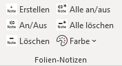

| Name                                               | Beschreibung                                       |
| -------------------------------------------------- | -------------------------------------------------- |
| Notizen (+)                                        | Fügt eine Bearbeitungsnotiz oben rechts auf der Folie ein inkl. Autor und Datum. |
| Notizen (I/O)                                      | Alle Notizen der aktuellen Folie temporär ausblenden und wieder einblenden. |
| Notizen (-)                                        | Alle Notizen der aktuellen Folie entfernen.        |
| Alle Notizen (I/O)                                 | Alle Notizen auf allen Folien temporär ausblenden und wieder einblenden. |
| Alle Notizen (-)                                   | Alle Notizen auf allen Folien entfernen.           |
| Farbe ändern                                       | Hintergrundfarbe für neue Bearbeitungsnotizen ändern. |
| Farbe ändern > Standardfarbe                       | Hintergrundfarbe für Bearbeitungsnotizen auf Standard zurücksetzen. |

### Tabelle aus Shapes

Ermöglicht die tabellenförmige Anordnung von Shapes. Das Feature `ppt_shapetables` muss installiert sein.

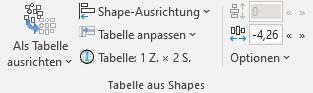

| Name                                               | Beschreibung                                       |
| -------------------------------------------------- | -------------------------------------------------- |
| Als Tabelle ausrichten                             | Richtet die ausgewählten Shapes als Tabelle aus mit errechnetem Zeilen- und Spaltenabstand. Mit SHIFT-Taste wird Abstand=0 gesetzt. |
| Menü zum Ausrichten als Tabelle                    | Shape-Tabelle mit verschiedenen Abstandsoptionen ausrichten |
| Menü zum Ausrichten als Tabelle > Als Tabelle ausrichten (Standardabstand) | Richtet die ausgewählten Shapes als Tabelle aus mit einem Standardabstand von 0,35cm (10pt) |
| Menü zum Ausrichten als Tabelle > Als Tabelle ausrichten (Median-Abstand) | Richtet die ausgewählten Shapes als Tabelle aus mit dem Median-Abstand der Shapes. |
| Menü zum Ausrichten als Tabelle > Als Tabelle ausrichten ohne Abstand [Shift] | Richtet die ausgewählten Shapes als Tabelle ohne Abstand aus. |
| Shape-Ausrichtung                                  | Legt Ausrichtung der Shapes innerhalb der Tabellenzellen fest. |
| Tabelle anpassen                                   | Shape-Tabelle auf verschiedene Weise anpassen oder transponieren |
| Tabelle anpassen > Shapes in Zellen einpassen      | Setzt die Größe der Shapes auf die Größe der Tabellenzellen. |
| Tabelle anpassen > Shapes in Zellen einpassen > Einpassen mit gleicher Tabellengröße | Setzt die Shape-Größe auf die Größe der Tabellenzelle. Dabei werden die Shapes vergrößert bzw. verkleinert, um die aktuelle Tabellengröße nicht zu verändern. |
| Tabelle anpassen > Shapes in Zellen einpassen > Einpassen mit angepasster Tabellengröße | Setzt die Shape-Größe auf die Größe der Tabellenzelle. Dabei werden die Shapes verschoben und die aktuelle Tabellegröße damit verändert. |
| Tabelle anpassen > Zellengrößen angleichen         | Normalisiert die Breite bzw. Höhe der Zellen.      |
| Tabelle anpassen > Zellengrößen angleichen > Spaltenbreite verteilen | Normalisiert die Breite aller Spalten ohne dabei die Tabellengröße zu verändern. |
| Tabelle anpassen > Zellengrößen angleichen > Zeilenhöhe verteilen | Normalisiert die Höhe aller Zeilen ohne dabei die Tabellengröße zu verändern. |
| Tabelle anpassen > Tabelle transponieren           | Transponiert (d.h. spiegelt) die Tabelle.          |
| Tabelle anpassen > Tabelle transponieren > Tabelle mit gleicher Tabellengröße transponieren | Transponiert die Tabelle, d.h. spiegelt die Zellen an der Hauptdiagonalen. Dabei wir auch die Größe der Zellen verändert, um die Tabellengröße nicht zu ändern. |
| Tabelle anpassen > Tabelle transponieren > Tabelle mit angepasster Tabellengröße transponieren | Transponiert die Tabelle, d.h. spiegelt die Zellen an der Hauptdiagonalen. Dabei wird die Größe der Zellen nicht verändert, sondern nur die Tabellengröße. |
| Tabelle anpassen > Tabelle in Bereich einpassen    | Positioniere die ausgewählten Shapes auf eine Standardposition. |
| Tabelle anpassen > Tabelle in Bereich einpassen > Benutzerdef. Bereich festlegen | Der benutzerdefinierte Bereich wird anhand des gewählten Shapes festgelegt. Dieser Bereich ist anschließend über die Gallery wählbar und wird dauerhaft in der aktuellen Prästentation vorgehalten. |
| Tabelleninformation                                | Zeigt Informationen über die Tabelle an. Nützlich um vorab herauszufinden, ob eine Tabelle korrekt erkannt wird. |
| Zeilenabstand                                      | Ändert den Zeilenabstand der Shapes. [ALT] wechselt zwischen Bewegen und Dehen/Stauchen. |
| Spaltenabstand                                     | Ändert den Spaltenabstand der Shapes. [ALT] wechselt zwischen Bewegen und Dehen/Stauchen. |
| Optionen                                           | Einstellungsmöglichkeiten beim Ausrichten der Shape-Tabellen |
| Optionen > Bewegen                                 | Gewünschter Shape-Abstand wird durch Positionierung von Shapes erreicht |
| Optionen > Dehnen/Stauchen                         | Gewünschter Shape-Abstand wird durch Verkleinerung/Vergrößerung von Shapes erreicht |
| Optionen > Zeilenabstand = Spaltenabstand          | Bei Veränderung des Zeilenabstands wird auch der Spaltenabstand geändert und umgekehrt |

### Kreisanordnung

Ermöglicht die kreisförmige Anordnung von Shapes. Das Feature `ppt_circlify` muss installiert sein.

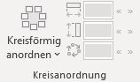

| Name                                               | Beschreibung                                       |
| -------------------------------------------------- | -------------------------------------------------- |
| Kreisförmig anordnen                               | Ausgewählte Shapes werden Kreis-förmig angeordnet, entsprechend der eingestellten Breite/Höhe. Die Reihenfolge der Shapes ist abhängig von der Selektionsreihenfolge: das zuerst selektierte Shape wird auf 12 Uhr positioniert, die weiteren Shapes folgen im Urzeigersinn. |
| Kreisanordnung Optionen                            | Einstellungen zur kreisförmigen Ausrichtung von Shapes |
| Kreisanordnung Optionen > Shape-Rotation an/aus    | Objekte in der Kreisanordnung entsprechend ihrer Position im Kreis rotieren |
| Kreisanordnung Optionen > Kreis (Breite = Höhe) an/aus | Bei Veränderung der Höhe wird auch die Breite geändert und umgekehrt |
| Kreisanordnung Optionen > Erstes Shapes in Mitte   | Das zuerst selektierte Shape wird in den Kreis-Mittelpunkt gesetzt |
| Kreisanordnung Optionen > Aktuelle Parameter interpolieren | Es wird versucht den aktuellen Radius, Anfangswinkel und die Optionen der ausgewählten Shapes näherungsweise zu bestimmen |
| Breite                                             | Breite der Ellipse (Diagonale) für die Kreisanordnung |
| Höhe                                               | Höhe der Ellipse (Diagonale) für die Kreisanordnung |
| Drehung                                            | Winkel des ersten Shapes gibt die Drehung der Kreisanornung an. |

### Styles

Ermöglicht die Speicherung von eigenen Formatierungen/Styles in Katalogen zur späteren Wiederverwendung. Das Feature `ppt_customformats` muss installiert sein.

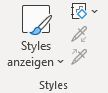

| Name                                               | Beschreibung                                       |
| -------------------------------------------------- | -------------------------------------------------- |
| Styles anzeigen                                    | Zeigt Übersicht über alle Custom-Styles im aktuellen Katalog. |
| Styles anzeigen > Neuen Style aufnehmen            | Nimmt Format vom gewählten Shape neu in die Gallerie auf. |
| Styles anzeigen > [STRG]+Klick für Bearbeiten und Löschen | Bei Klick auf ein Custom-Style mit gedrückter STRG-Taste öffnet sich ein Fenster zur Bearbeitung und Löschung dieses Styles. |
| Styles anzeigen > [SHIFT]+Klick für Anlage neues Shape | Bei Klick auf ein Custom-Style mit gedrückter SHIFT-Taste wird immer ein neues Shapes in gewähltem Style angelegt. |
| Styles anzeigen > Einschränkungen durch PowerPoint-Bugs | Liste von funktionalen Einschränkungen durch interne PowerPoint-Bugs anzeigen |
| Styles konfiguration                               | Style-Katalog laden oder neuen Katalog anlegen.    |
| Format anwenden                                    | Ausgewählte Formate aus Zwischenspeicher auf selektierte Shapes anwenden.  Mit STRG kann die Auswahl der Formate erneut bearbeitet werden. |
| Format aufnehmen                                   | Format aus selektiertem Shape in Zwischenspeicher aufnehmen. |

### QuickEdit

Aktiviert eine kleine freischwebende Mini-Toolbar mit einer interaktiven Farbauswahl. Das Feature `ppt_quickedit` muss installiert sein.

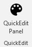

| Name                                               | Beschreibung                                       |
| -------------------------------------------------- | -------------------------------------------------- |
| QuickEdit Panel                                    | Blendet das QuickEdit Panel mit der interaktiven Farbauswahl ein. |

### Statistik

Ermöglicht die Anzeige einfacher Statistiken zur schnellen Überprüfung von zahlenlastigen Folien. Das Feature `ppt_statistics` muss installiert sein.

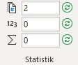

| Name                                               | Beschreibung                                       |
| -------------------------------------------------- | -------------------------------------------------- |
| Anzahl Shapes                                      | Zählt die Anzahl der ausgewählten Shapes (inkl. Shapes innerhalb von Gruppen bzw. Zellen innerhalb von Tabellen). |
| Neu laden                                          | Statistiken für aktuelle Auswahl neu berechnen     |
| Anzahl Zahlen                                      | Zählt die Anzahl der erkennbaren Zahlen in der aktuellen Auswahl, die im Feld Summe aufsummiert angezeigt werden. |
| Neu laden                                          | Statistiken für aktuelle Auswahl neu berechnen     |
| Summe                                              | Summiert alle erkennbaren Zahlen in der aktuellen Auswahl. Je nach Sprache der Rechtschreibkorrektur wird Punkt oder Komma als Dezimaltrenner genommen. Negative Zahlen werden abgezogen. |
| Neu laden                                          | Statistiken für aktuelle Auswahl neu berechnen     |

## \[BKT\] Harvey Balls

### Harvey Balls

| Name                                               | Beschreibung                                       |
| -------------------------------------------------- | -------------------------------------------------- |
| Neuer Harvey Ball                                  | Füge ein Harvey-Ball ein, welcher sich bzgl. Farbe/Füllstand konfigurieren lässt.  Farbe und Füllstand lassen sich über Kontext-Menü und Kontext-Tab konfigurieren, im Tab auch Prozent-Angaben möglich.  Ein Harvey-Ball-Shape ist eine Gruppe aus Kreis- und Torten-Shape. |
| Harvey Ball duplizieren                            | Dupliziert den aktuell ausgewählten Harvey-Ball.   |
| Füllstand ändern                                   | Passe den Füllstand eines Harvey-Balls entsprechend der Auswahl an.  Ein Harvey-Ball-Shape ist eine Gruppe aus Kreis- und Torten-Shape. |
| Farbe ändern                                       | Passe die Farbe eines Harvey-Balls entsprechend der Auswahl an.  Ein Harvey-Ball-Shape ist eine Gruppe aus Kreis- und Torten-Shape. |
| Hintergrund ändern                                 | Passe die Hintergrund-Farbe eines Harvey-Balls entsprechend der Auswahl an.  Ein Harvey-Ball-Shape ist eine Gruppe aus Kreis- und Torten-Shape. |
| Hintergrund ändern > Hintergrund aus               | Harvey-Ball Hintergrund auf transparent setzen     |
| Style klassisch                                    | Harvey-Ball im klassischen Style ohne zusätzlichem Rand darstellen. |
| Style modern                                       | Harvey-Ball im modernen Style mit weißem Rand darstellen. |
| Füllstand in %                                     | Passe den Füllstand eines Harvey-Balls entsprechend der Auswahl an.  Ein Harvey-Ball-Shape ist eine Gruppe aus Kreis- und Torten-Shape. |
| 0%                                                 | Setzt alle gewählten Harvey-Balls auf 0%           |
| 25%                                                | Setzt alle gewählten Harvey-Balls auf 25%          |
| 33%                                                | Setzt alle gewählten Harvey-Balls auf 33%          |
| 50%                                                | Setzt alle gewählten Harvey-Balls auf 50%          |
| 66%                                                | Setzt alle gewählten Harvey-Balls auf 66%          |
| 75%                                                | Setzt alle gewählten Harvey-Balls auf 75%          |
| 100%                                               | Setzt alle gewählten Harvey-Balls auf 100%         |

## \[BKT\] Agenda

### Anleitung

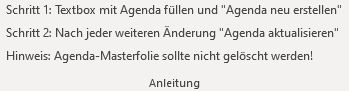

### Agenda

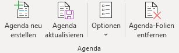

| Name                                               | Beschreibung                                       |
| -------------------------------------------------- | -------------------------------------------------- |
| Agenda neu erstellen                               | Neue Agenda auf Basis des aktuellen Slides erstellen. Aktuelles Slide wird Master-Slide der Agenda. |
| Agenda aktualisieren                               | Agenda aktualisieren und durch Agenda auf dem Agenda-Master-Slide ersetzen; Folien werden dabei neu erstellt. |
| Optionen                                           | Verschiedene Agenda-Optionen ändern                |
| Optionen > Agenda-Slides für Unterpunkte           | Für Unterpunkte eines Agendapunkts (Indent-Level>1) werden Agenda-Slides erstellt |
| Optionen > Andere Agenda-Unterpunkte ausblenden    | Unterpunkte eines Agendapunkts (Indent-Level>1) werden in den anderen Abschnitten ausgeblendet |
| Optionen > Abschnitte für Agenda-Punkte erstellen  | Einen neuen Abschnitt je Agenda-Folie beginnen.    |
| Optionen > Hyperlinks für Agenda-Punkte erstellen  | Jeden Agenda-Punkt mit der zugehörigen Agenda-Folie verlinken. |
| Agenda-Folien entfernen                            | Entfernt alle Agenda-Folien, die zur aktuellen Agenda gehören, außer der Master-Folie. Alle Meta-Informationen werden gelöscht. |

### Agenda Selektor

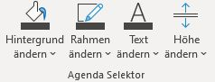

| Name                                               | Beschreibung                                       |
| -------------------------------------------------- | -------------------------------------------------- |
| Hintergrund ändern                                 | Passe die Hintergrundfarbe für den Selektor, der den aktiven Agendapunkt hervorhebt, an. |
| Hintergrund ändern > Keine Füllung                 | Selektor-Hintergrund auf transparent ändern        |
| Hintergrund ändern > Zurücksetzen                  | Selektor-Hintergrund auf Standard zurücksetzen     |
| Rahmen ändern                                      | Passe die Linienfarbe für den Selektor, der den aktiven Agendapunkt hervorhebt, an. |
| Rahmen ändern > Kein Rahmen                        | Selektor-Rahmen auf transparent ändern             |
| Rahmen ändern > Zurücksetzen                       | Selektor-Rahmen auf Standard zurücksetzen          |
| Text ändern                                        | Passe die Textfarbe für den Selektor, der den aktiven Agendapunkt hervorhebt, an. |
| Text ändern > Fett                                 | Selektor-Text fett darstellen ein/aus              |
| Text ändern > Kursiv                               | Selektor-Text kursiv darstellen ein/aus            |
| Text ändern > Unterstrichen                        | Selektor-Text unterstrichen darstellen ein/aus     |
| Text ändern > Zurücksetzen                         | Selektor-Text auf Standard zurücksetzen            |
| Höhe ändern                                        | Passt die Höhe des Selektors relativ zur Schriftgröße an. |
| Höhe ändern > 20% (Standard)                       | Selektor-Überhang entspricht 20% der Schriftgröße  |
| Höhe ändern > 40%                                  | Selektor-Überhang entspricht 40% der Schriftgröße  |
| Höhe ändern > 60%                                  | Selektor-Überhang entspricht 60% der Schriftgröße  |
| Höhe ändern > 80% (sehr groß)                      | Selektor-Überhang entspricht 80% der Schriftgröße  |

## \[BKT\] Verknüpfte Shapes

### Verknüpfte Shapes finden

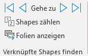

| Name                                               | Beschreibung                                       |
| -------------------------------------------------- | -------------------------------------------------- |
| Verknüpfte Shapes zählen                           | Zählt die Anzahl der verknüpften Shapes auf allen Folien. |
| Nächstes verknüpfte Shape finden                   | Sucht nach dem nächste verknüpften Shape. Sollte auf den Folgefolien kein Shape mehr kommen, wird das erste verknüpfte Shape der Präsentation gesucht. |
| Erstes verknüpfte Shape finden                     | Sucht nach dem ersten verknüpften Shape.           |

### Verknüpfte Shapes angleichen

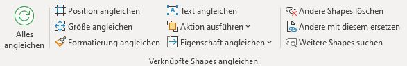

| Name                                               | Beschreibung                                       |
| -------------------------------------------------- | -------------------------------------------------- |
| Alles angleichen                                   | Alle Eigenschaften aller verknüpfter Shapes wie ausgewähltes Shape setzen. |
| Position angleichen                                | Position und Rotation aller verknüpfter Shapes auf Position wie ausgewähltes Shape setzen. |
| Größe angleichen                                   | Größe aller verknüpfter Shapes auf Größe wie ausgewähltes Shape setzen. |
| Formatierung angleichen                            | Formatierung aller verknüpfter Shapes auf Größe wie ausgewähltes Shape setzen. |
| Text angleichen                                    | Text aller verknüpfter Shapes auf Größe wie ausgewähltes Shape setzen. |
| Aktion ausführen                                   | Diverse Aktionen auf alle verknüpften Shapes ausführen |
| Aktion ausführen > In den Vordergrund              | Alle verknüpften Shapes in den Vordergrund bringen |
| Aktion ausführen > In den Hintergrund              | Alle verknüpften Shapes in den Hintergrund bringen |
| Aktion ausführen > Horizontal spiegeln             | Alle verknüpften Shapes horizontal spiegeln        |
| Aktion ausführen > Vertikal spiegeln               | Alle verknüpften Shapes vertikal spiegeln          |
| Aktion ausführen > Foliennummer einfügen           | Fügt allen verknüpften Shapes am Ende vom Text automatisch aktualisierbare Foliennummer an |
| Aktion ausführen > Groß-/Kleinschreibung ändern    | Groß-/Kleinschreibung für alle verknüpften Shapes anpassen |
| Aktion ausführen > Groß-/Kleinschreibung ändern > Ersten Buchstaben im Satz großschreiben | Ersten Buchstaben im Satz aller verknüpften Shapes großschreiben |
| Aktion ausführen > Groß-/Kleinschreibung ändern > kleinbuchstaben | Text aller verknüpften Shapes kleinschreiben       |
| Aktion ausführen > Groß-/Kleinschreibung ändern > GROẞBUCHSTABEN | Text aller verknüpften Shapes großschreiben        |
| Aktion ausführen > Groß-/Kleinschreibung ändern > Ersten Buchstaben Im Wort Großschreiben | Ersten Buchstaben im Wort aller verknüpften Shapes großschreiben |
| Aktion ausführen > Groß-/Kleinschreibung ändern > gROẞ-/kLEINSCHREIBUNG umkehren | Groß-/Kleinschreibung aller verknüpften Shapes umkehren |
| Eigenschaft angleichen                             | Eine einzelne Eigenschaft auf alle verknüpften Shapes übertragen |
| Eigenschaft angleichen > Text (ohne Formatierung)  | Text ohne Formatierungen für alle verknüpften Shapes angleichen |
| Eigenschaft angleichen > Seitenverhältnis gesperrt | Seitenverhältnis sperren an/aus für alle verknüpften Shapes angleichen |
| Eigenschaft angleichen > Rotation                  | Rotation für alle verknüpften Shapes angleichen    |
| Eigenschaft angleichen > Schwarz-Weiß-Modus        | Schwarz-Weiß-Modus für alle verknüpften Shapes angleichen |
| Eigenschaft angleichen > Linke Seite               | Linke Seite für alle verknüpften Shapes angleichen |
| Eigenschaft angleichen > Rechte Seite              | Rechte Seite für alle verknüpften Shapes angleichen |
| Eigenschaft angleichen > Obere Seite               | Obere Seite für alle verknüpften Shapes angleichen |
| Eigenschaft angleichen > Untere Seite              | Untere Seite für alle verknüpften Shapes angleichen |
| Eigenschaft angleichen > Mittelpunkt links         | Mittelpunkt links für alle verknüpften Shapes angleichen |
| Eigenschaft angleichen > Mittelpunkt oben          | Mittelpunkt oben für alle verknüpften Shapes angleichen |
| Eigenschaft angleichen > Breite                    | Breite für alle verknüpften Shapes angleichen      |
| Eigenschaft angleichen > Höhe                      | Höhe für alle verknüpften Shapes angleichen        |
| Andere Shapes löschen                              | Alle verknüpften Shapes auf allen Folien löschen.  |
| Andere mit diesem ersetzen                         | Alle verknüpften Shapes auf allen Folien mit ausgewähltem Shape ersetzen. |
| Weitere Shapes suchen                              | Erneut nach Shapes anhand Position und Größe suche, um weitere Shapes zu dieser Verknüpfung hinzuzufügen. |

### Verknüpfung aufheben

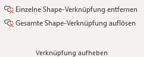

| Name                                               | Beschreibung                                       |
| -------------------------------------------------- | -------------------------------------------------- |
| Einzelne Shape-Verknüpfung entfernen               | Entfernt die ID zur Verknüpfung vom aktuellen Shape. Alle anderen Shapes mit der gleichen ID bleiben verknüpft. |
| Gesamte Shape-Verknüpfung auflösen                 | Entfernt die ID zur Verknüpfung vom aktuellen Shape sowie allen verknüpften Shapes mit der gleichen ID. |

## Bildtools

Dieses Standard-Tab wird nur bei Auswahl einer Grafik angezeigt.

### Format

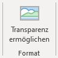

| Name                                               | Beschreibung                                       |
| -------------------------------------------------- | -------------------------------------------------- |
| Transparenz ermöglichen                            | Ersetzt das Bild durch ein Shape mit Bildfüllung, welches nativ transparent gemacht werden kann. Dabei wird das bestehende Bild exportiert und dann gelöscht, d.h. etwaige zugeschnittene Bereiche gehen verloren und Bildformate können nicht rückgängig gemacht werden. |

## Konsol./Teilen

Diese Funktionen sind im sog. Backstage-Bereich bei Klick auf Datei in der linken Seitenleiste.

### Folien aus Dateien anfügen

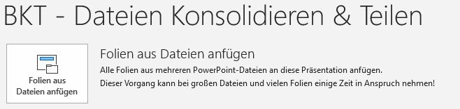

| Name                                               | Beschreibung                                       |
| -------------------------------------------------- | -------------------------------------------------- |
| Folien aus Dateien anfügen                         | Alle Folien aus mehreren PowerPoint-Dateien an diese Präsentation anfügen |

### Folien aus Bildern erstellen

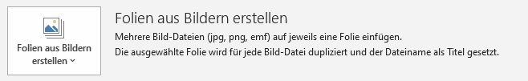

| Name                                               | Beschreibung                                       |
| -------------------------------------------------- | -------------------------------------------------- |
| Folien aus Bildern erstellen                       | Mehrere Bild-Dateien (jpg, png, emf) auf jeweils eine Folie einfügen |
| Folien aus Bildern erstellen > Bild-Dateien auswählen | Alle Bild-Dateien zum Einfügen einzeln auswählen.  |
| Folien aus Bildern erstellen > Ordner mit Bildern auswählen | Ordner mit Bild-Dateien zum Einfügen auswählen.    |

### Folien einzeln speichern

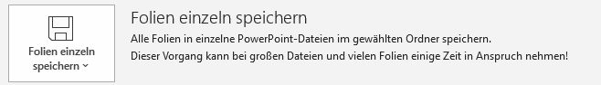

| Name                                               | Beschreibung                                       |
| -------------------------------------------------- | -------------------------------------------------- |
| Folien einzeln speichern                           | Alle Folien in einzelne PowerPoint-Dateien im gewählten Ordner speichern |
| Folien einzeln speichern > Folien einzeln speichern | Jede Folie einzeln speichern. Die Dateien werden mit Foliennummer nummeriert und nach Folientitel benannt. |
| Folien einzeln speichern > Abschnitte einzeln speichern | Jeden Abschnitt einzeln speichern. Die Dateien werden nummeriert und nach Abschnittstitel benannt. |

---

## Kontextmenüs

### ContextMenuSpell

Kontextmenü für rot unterstrichene Wörter

| Name                                               | Beschreibung                                       |
| -------------------------------------------------- | -------------------------------------------------- |
| Sprache ändern                                     | Sprache der Rechtschreibkorrektur ausgewählten Text anpassen |

### ContextMenuShape

Kontextmenü bei Auswahl eines einzelnen Shapes

| Name                                               | Beschreibung                                       |
| -------------------------------------------------- | -------------------------------------------------- |
| Sprache ändern                                     | Sprache der Rechtschreibkorrektur für ausgewähltes Shape anpassen |
| Shape-Text zerlegen                                | Zerlege die markierten Shapes anhand der Text-Absätze in mehrere Shapes. Pro Absatz wird ein Shape mit dem entsprechenden Text angelegt. |
| Text auf Shape zerlegen                            | Überführe jeweils den Textinhalt der markierten Shapes in ein separates Text-Shape. |
| Mit Zwischenablage ersetzen                        | Markiertes Shape mit dem Inhalt der Zwischenablage ersetzen und dabei Größe und Position erhalten. |
| Verknüpfte Shapes angleichen                       | Alle Eigenschaften aller verknüpfter Shapes wie ausgewähltes Shape setzen. |
| Verknüpfte Shapes angleichen Menü                  | Auswählen, was angeglichen werden soll             |
| Verknüpfte Shapes angleichen Menü > Alles angleichen |                                                    |
| Verknüpfte Shapes angleichen Menü > Position angleichen |                                                    |
| Verknüpfte Shapes angleichen Menü > Größe angleichen |                                                    |
| Verknüpfte Shapes angleichen Menü > Formatierung angleichen |                                                    |
| Verknüpfte Shapes angleichen Menü > Text angleichen |                                                    |
| Verknüpfte Shapes angleichen Menü > In den Vordergrund |                                                    |
| Verknüpfte Shapes angleichen Menü > In den Hintergrund |                                                    |
| Verknüpfte Shapes angleichen Menü > Andere löschen |                                                    |
| Verknüpfte Shapes angleichen Menü > Andere mit diesem ersetzen |                                                    |
| Verknüpftes Shape anlegen                          | Entweder ähnliche Shapes auf Folgefolien anhand Position oder Größe suchen, oder dieses Shape auf Folgefolien kopieren und verknüpfen. |
| Verknüpftes Shape anlegen > Ähnliche Shapes suchen… |                                                    |
| Verknüpftes Shape anlegen > Dieses Shape kopieren… |                                                    |

### ContextMenuTextEdit

Kontextmenü innerhalb eines Textfelds oder bei selektiertem Text

| Name                                               | Beschreibung                                       |
| -------------------------------------------------- | -------------------------------------------------- |
| Sprache ändern                                     | Sprache der Rechtschreibkorrektur ausgewählten Text anpassen |

### ContextMenuFrame

Kontextmenü für leere Stelle auf der Folie

| Name                                               | Beschreibung                                       |
| -------------------------------------------------- | -------------------------------------------------- |
| Als Folien-Thumbnail einfügen                      | Als aktualisierbares Folien-Thumbnail im PNG-Format einfügen |
| Als Folien-Thumbnail einfügen Menü                 | Format zum Einfügen des Thumbnails auswählen       |
| Als Folien-Thumbnail einfügen Menü > Als PNG einfügen (Standard) |                                                    |
| Als Folien-Thumbnail einfügen Menü > Als Bitmap einfügen |                                                    |
| Als Folien-Thumbnail einfügen Menü > Als Vektor (EMF) einfügen |                                                    |

### ContextMenuPicture

Kontextmenü für Grafiken und Bilder

| Name                                               | Beschreibung                                       |
| -------------------------------------------------- | -------------------------------------------------- |
| Mit Zwischenablage ersetzen                        | Markiertes Shape mit dem Inhalt der Zwischenablage ersetzen und dabei Größe und Position erhalten. |
| Verknüpfte Shapes angleichen                       | Alle Eigenschaften aller verknüpfter Shapes wie ausgewähltes Shape setzen. |
| Verknüpfte Shapes angleichen Menü                  | Auswählen, was angeglichen werden soll             |
| Verknüpfte Shapes angleichen Menü > Alles angleichen |                                                    |
| Verknüpfte Shapes angleichen Menü > Position angleichen |                                                    |
| Verknüpfte Shapes angleichen Menü > Größe angleichen |                                                    |
| Verknüpfte Shapes angleichen Menü > Formatierung angleichen |                                                    |
| Verknüpfte Shapes angleichen Menü > Text angleichen |                                                    |
| Verknüpfte Shapes angleichen Menü > In den Vordergrund |                                                    |
| Verknüpfte Shapes angleichen Menü > In den Hintergrund |                                                    |
| Verknüpfte Shapes angleichen Menü > Andere löschen |                                                    |
| Verknüpfte Shapes angleichen Menü > Andere mit diesem ersetzen |                                                    |
| Verknüpftes Shape anlegen                          | Entweder ähnliche Shapes auf Folgefolien anhand Position oder Größe suchen, oder dieses Shape auf Folgefolien kopieren und verknüpfen. |
| Verknüpftes Shape anlegen > Ähnliche Shapes suchen… |                                                    |
| Verknüpftes Shape anlegen > Dieses Shape kopieren… |                                                    |
| Thumbnail aktualisieren                            | Ausgewähltes Folien-Thumbnail aktualisieren        |
| Thumbnail-Einstellungen                            | Einstellungen des gewählten Folien-Thumbnails ändern |
| Thumbnail-Einstellungen > Seitenverhältnis zurücksetzen |                                                    |
| Folien-Referenz                                    | Referenz des gewählten Folien-Thumbnails öffnen oder ändern |
| Folien-Referenz > Öffnen                           | Referenzierte Datei öffnen und Thumbnail-Folie auswählen. |
| Folien-Referenz > Datei ersetzen…                  | Öffnet Datei-Auswahldialog um referenzierte Datei zu ersetzen. Die Datei muss die gleiche Folien-ID enthalten. |
| Folien-Referenz > Überschreiben                    | Aktuelle Folien-Referenz ersetzen mit kopierter Folie aus Zwischenablage. |
| Folien-Referenz > Löschen                          | Folien-Referenz löschen und Thumbnail damit in normales Bild umwandeln. |

### ContextMenuObjectsGroup

Kontextmenü bei Auswahl mehrerer Shapes oder Objekte

| Name                                               | Beschreibung                                       |
| -------------------------------------------------- | -------------------------------------------------- |
| Überschrift anordnen                               | Kopfzeile (Überschrift) wieder richtig auf dem Prozessschritt-Shape positionieren |
| In Prozess konvertieren                            | Ausgewählte Prozess-Shapes in eine interaktive Prozess-Gruppe umwandeln, um einfach Prozesschritte hinzuzufügen |
| Füllstand ändern                                   | Passe den Füllstand eines Harvey-Balls entsprechend der Auswahl an.  Ein Harvey-Ball-Shape ist eine Gruppe aus Kreis- und Torten-Shape. |
| Farbe ändern                                       | Passe die Farbe eines Harvey-Balls entsprechend der Auswahl an.  Ein Harvey-Ball-Shape ist eine Gruppe aus Kreis- und Torten-Shape. |
| Verbindungstypen                                   | Verbindungstyp für alle ausgewählten Verbinder ändern |
| Verbindungstypen > Gerader Verbinder               |                                                    |
| Verbindungstypen > Gewinkelte Verbindung           |                                                    |
| Verbindungstypen > Gekrümmte Verbindung            |                                                    |
| Verbindungen neu erstellen                         | Alle ausgewählten Verbinder neu erstellen          |
| Pfeilrichtung umdrehen                             | Pfeilrichtung des Verbinders umkehren              |
| Sprache ändern                                     | Sprache der Rechtschreibkorrektur für ausgewählte Shapes anpassen |
| Text in Shape kombinieren                          | Kopiere den Text eines Text-Shapes in das zweite markierte Shape und löscht das Text-Shape. |
| Shape-Text zusammenführen                          | Führe die markierten Shapes in ein Shape zusammen. Der Text aller Shapes wird übernommen und aneinandergehängt. |
| Shape-Texte löschen                                | Führe die markierten Shapes in ein Shape zusammen. Der Text aller Shapes wird übernommen und aneinandergehängt. |
| Shape-Texte ersetzen…                              | Text aller gewählten Shapes mit im Dialogfeld eingegebenen Text ersetzen. |
| In Gruppe einfügen                                 | Sofern das zuerst oder zuletzt markierte Shape eine Gruppe ist, werden alle anderen Shapes in diese Gruppe eingefügt. Anderenfalls werden alle Shapes gruppiert. |
| Mit Zwischenablage ersetzen                        | Markiertes Shape mit dem Inhalt der Zwischenablage ersetzen und dabei Größe und Position erhalten. |
| Verknüpfte Shapes angleichen                       | Alle Eigenschaften aller verknüpfter Shapes wie ausgewähltes Shape setzen. |
| Verknüpfte Shapes angleichen Menü                  | Auswählen, was angeglichen werden soll             |
| Verknüpfte Shapes angleichen Menü > Alles angleichen |                                                    |
| Verknüpfte Shapes angleichen Menü > Position angleichen |                                                    |
| Verknüpfte Shapes angleichen Menü > Größe angleichen |                                                    |
| Verknüpfte Shapes angleichen Menü > Formatierung angleichen |                                                    |
| Verknüpfte Shapes angleichen Menü > Text angleichen |                                                    |
| Verknüpfte Shapes angleichen Menü > In den Vordergrund |                                                    |
| Verknüpfte Shapes angleichen Menü > In den Hintergrund |                                                    |
| Verknüpfte Shapes angleichen Menü > Andere löschen |                                                    |
| Verknüpfte Shapes angleichen Menü > Andere mit diesem ersetzen |                                                    |
| Verknüpftes Shape anlegen                          | Entweder ähnliche Shapes auf Folgefolien anhand Position oder Größe suchen, oder dieses Shape auf Folgefolien kopieren und verknüpfen. |
| Verknüpftes Shape anlegen > Ähnliche Shapes suchen… |                                                    |
| Verknüpftes Shape anlegen > Dieses Shape kopieren… |                                                    |

### ContextMenuThumbnail

Kontextmenü für die Folien-Vorschau im rechten Panel

| Name                                               | Beschreibung                                       |
| -------------------------------------------------- | -------------------------------------------------- |
| Auf ausgewählte Folien einfügen                    | Zwischenablage auf allen ausgewählten Folien einfügen |
| Sprache ändern                                     | Sprache der Rechtschreibkorrektur für ausgewählte Folien anpassen |
| Ausgewählte Folien exportieren                     | Ausgewählte Folien als eigene Präsentation exportieren oder als E-Mail versenden |
| Ausgewählte Folien exportieren > Speichern         | Speichert die ausgewählten Folien in einer neuen Präsentation. |
| Ausgewählte Folien exportieren > Senden            | Sendet die ausgewählten Folien als E-Mail Anhang.  |
| Als Folien-Thumbnail kopieren                      | Gewählte Folie als aktualisierbares Thumbnail kopieren |

### ContextMenuShapeConnector

Kontextmenü für einen einzelnen Verbinder

| Name                                               | Beschreibung                                       |
| -------------------------------------------------- | -------------------------------------------------- |
| Pfeilrichtung umdrehen                             | Pfeilrichtung des Verbinders umkehren              |

### ContextMenuShapeFreeform

Kontextmenü für sog. Freeform-Shapes, also Shape mit beliebiger selbst erstellter Form

| Name                                               | Beschreibung                                       |
| -------------------------------------------------- | -------------------------------------------------- |
| Überschrift anordnen                               | Kopfzeile (Überschrift) wieder richtig auf dem Prozessschritt-Shape positionieren |
| Verbindungsfläche neu verbinden                    | Aktualisiere die Verbindungsfläche nachdem sich die verbundenen Shapes geändert haben. |
| Mit Zwischenablage ersetzen                        | Markiertes Shape mit dem Inhalt der Zwischenablage ersetzen und dabei Größe und Position erhalten. |
| Verknüpfte Shapes angleichen                       | Alle Eigenschaften aller verknüpfter Shapes wie ausgewähltes Shape setzen. |
| Verknüpfte Shapes angleichen Menü                  | Auswählen, was angeglichen werden soll             |
| Verknüpfte Shapes angleichen Menü > Alles angleichen |                                                    |
| Verknüpfte Shapes angleichen Menü > Position angleichen |                                                    |
| Verknüpfte Shapes angleichen Menü > Größe angleichen |                                                    |
| Verknüpfte Shapes angleichen Menü > Formatierung angleichen |                                                    |
| Verknüpfte Shapes angleichen Menü > Text angleichen |                                                    |
| Verknüpfte Shapes angleichen Menü > In den Vordergrund |                                                    |
| Verknüpfte Shapes angleichen Menü > In den Hintergrund |                                                    |
| Verknüpfte Shapes angleichen Menü > Andere löschen |                                                    |
| Verknüpfte Shapes angleichen Menü > Andere mit diesem ersetzen |                                                    |
| Verknüpftes Shape anlegen                          | Entweder ähnliche Shapes auf Folgefolien anhand Position oder Größe suchen, oder dieses Shape auf Folgefolien kopieren und verknüpfen. |
| Verknüpftes Shape anlegen > Ähnliche Shapes suchen… |                                                    |
| Verknüpftes Shape anlegen > Dieses Shape kopieren… |                                                    |

