# Übersicht aller Funktionen für Excel | [PowerPoint](overview.md)
{:.no_toc}

Hier ist eine Übersicht aller Funktionen der BKT in Excel sortiert nach den jeweiligen Tabs/Reitern und Gruppen, sowie eine Übersicht der Funktionen in Kontextmenüs.
*Kursiv geschriebene Funktionen sind Standardfunktionen von Excel, daher ist teilweise keine Beschreibung vorhanden.*

1. TOC
{:toc}

---

## Toolbox 1/3

### Ablage

| Name                                               | Beschreibung                                       |
| -------------------------------------------------- | -------------------------------------------------- |
| *Einfügen*                                         | Eine Einfügeoption auswählen. Sie können beispielsweise Formatierungen beibehalten oder nur Inhalte einfügen. |
| *Kopieren*                                         | Auswählen, wie die Auswahl kopiert werden soll.    |
| *Format übertragen*                                | Gefällt Ihnen das Aussehen eines bestimmten Abschnitts? Sie können dieses Aussehen auf andere Inhalte im Dokument anwenden.  Und so wird's gemacht: 1. Wählen Sie Inhalt mit der gewünschten Formatierung aus. 2. Klicken Sie auf "Format übertragen". 3. Wählen Sie Inhalt aus, auf den die Formatierung automatisch angewendet werden soll.  Info: Wenn Sie die Formatierung an mehreren Stellen anwenden möchten, doppelklicken Sie auf "Format übertragen". |

### Schriftart

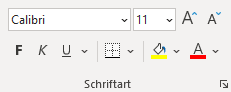

### Sonst.

| Name                                               | Beschreibung                                       |
| -------------------------------------------------- | -------------------------------------------------- |
| Über Auswahl zentrieren                            | Ausgewählte zellen 'Über Auswahl zentriert' ausrichten, d.h es werden verbundene Zellen simuliert. |
| *Blocksatz*                                        | Text gleichmäßig zwischen den Seitenrändern anordnen.  Blocksatz verleiht Ihrem Dokument klare, präzise Ränder und macht einen professionellen Eindruck. |
| *Durchstreichen*                                   | Streichen Sie ein Element durch, indem Sie eine Linie mitten hindurchziehen. |

### Ausrichtung

### Zahl

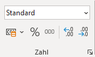

### Formatvorlagen

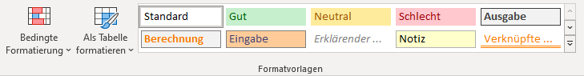

### Zellen

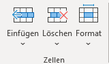

### Bearbeiten

### Gliederung

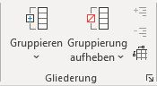

| Name                                               | Beschreibung                                       |
| -------------------------------------------------- | -------------------------------------------------- |
| *Gruppieren*                                       | Zeilen oder Spalten gruppieren oder automatisch eine Gliederung erstellen. |
| *Gruppierung aufheben*                             | Die Gruppierung eines Zellenbereichs aufheben.     |
| *Detail anzeigen*                                  | Eine reduzierte Zellgruppe erweitern.              |
| *Detail ausblenden*                                | Eine Zellgruppe reduzieren.                        |
| *Gliederungssymbole anzeigen*                      |                                                    |

### Settings

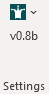

| Name                                               | Beschreibung                                       |
| -------------------------------------------------- | -------------------------------------------------- |
| Settings                                           | BKT-Einstellungen verwalten, BKT neu laden, Website aufrufen, etc. |
| Settings > Über BKT r21-01-29 v2.7.3               | Erweiterte Versionsinformationen anzeigen          |
| Settings > Auf neue Version prüfen                 | Überprüfen, ob neue BKT-Version verfügbar ist      |
| Settings > Auf neue Version prüfen Optionen        | Einstellungen zur automatischen Überprüfung auf neue Versionen |
| Settings > Auf neue Version prüfen Optionen > Jetzt auf neue Version prüfen | Überprüfen, ob neue BKT-Version verfügbar ist      |
| Settings > Auf neue Version prüfen Optionen > Wöchentlich | Sucht automatisch ein mal pro Woche beim PowerPoint-Start nach einer neuen BKT-Version |
| Settings > Auf neue Version prüfen Optionen > Wöchentlich, nur freitags | Sucht automatisch jeden Freitag, spätestens aber nach 31 Tagen, beim PowerPoint-Start nach einer neuen BKT-Version |
| Settings > Auf neue Version prüfen Optionen > Monatlich | Sucht automatisch ein mal pro Monat beim PowerPoint-Start nach einer neuen BKT-Version |
| Settings > Auf neue Version prüfen Optionen > Nie  | Automatische Suche nach einer neuen BKT-Version deaktivieren |
| Settings > Website: bkt-toolbox.de                 | BKT-Webseite im Browser öffnen                     |
| Settings > Versionsänderungen anzeigen             | Präsentation mit den Versionsänderungen anzeigen   |
| Settings > Feature-Ordner                          | Feature-Ordner hinzufügen oder entfernen           |
| Settings > Addin neu laden                         | BKT-Addin beenden und neu laden (ähnlich PowerPoint-Neustart) |
| Settings > Ribbon aktualisieren                    | Oberfläche aktualisieren und alle Werte neu laden (sog. Invalidate ausführen) |
| Settings > Öffne BKT-Ordner                        | Öffne Ordner mit BKT-Framework und Konfigurationsdatei |
| Settings > Öffne config.txt                        | Öffne Konfigurationsdatei im Standardeditor        |
| Settings > Key-/Mouse-Hooks an/aus                 | Tastatur-/Maus-Events für aktuelle Sitzung ein- oder ausschalten |
| v0.8b                                              | Excel Toolbox v0.8 beta BKT r21-01-29           |

## Toolbox 2/3 BETA

### Zellen-Inhalte

| Name                                               | Beschreibung                                       |
| -------------------------------------------------- | -------------------------------------------------- |
| Formel anwenden…                                   | Eine Formel auf alle ausgwählten Zellen anwenden.  |
| RegEx anwenden…                                    | Einen regulären Ausdruck auf alle ausgwählten Zellen anwenden. |
| RegEx anwenden… > Mit RegEx zählen/filtern         | Die Anzahl der Ergebnisse/Gruppen eines regulären Ausdrucks für ausgewählte Zellen in jeweilige Zelle schreiben. |
| RegEx anwenden… > Mit RegEx in Spalten aufteilen   | Alle Ergebnisse/Gruppen eines regulären Ausdrucks für ausgewählte Zellen in Spalten aufteilen. |
| RegEx anwenden… > Mit RegEx suchen und ersetzen    | Mit einem regulären Ausdruck in ausgewählten Zellen suchen und ersetzen. |
| Textwerkzeuge                                      | Text hinzufügen oder schneiden.                    |
| Textwerkzeuge > Text voranstellen…                 | Einen Text allen ausgewählten Zellen voranstellen. |
| Textwerkzeuge > Text anhängen…                     | Einen Text allen ausgewählten Zellen anhängen.     |
| Textwerkzeuge > Text anhand Position schneiden…    | Einen Text vorne oder hinten nach gegebener Position abschneiden. |
| Textwerkzeuge > Text anhand Zeichen schneiden…     | Einen Text vorne oder hinten nach gegebenem Zeichen abschneiden. |
| Textwerkzeuge > *Ersetzen...*                      | Suchen Sie nach Text, den Sie ändern möchten, und ersetzen Sie ihn durch etwas anderes. |
| Formeln zu Werten                                  | Formeln in allen ausgewählten Zellen durch jeweilige Werte ersetzen. Zellen ohne Formeln bleiben unverändert. |
| Formeln zu Werten                                  | Formeln in allen ausgewählten Zellen durch jeweilige Werte ersetzen. Zellen ohne Formeln bleiben unverändert. |
| Zu angezeigtem Text                                | Werte in allen ausgewählten Zellen durch den tatsächlich angezeigten Text ersetzen. Dabei wird das Zellenformat auf 'Text' geändert. |
| Zahlenwerte zu Text                                | Konvertiert numerische Werte (Zahlen, Datum, Zeit) in als Text gespeicherte Zahlen. Dabei wird das Zellenformat auf 'Text' geändert. |
| Text zu Zahlen                                     | Konvertiert als Text gespeicherte Zahlen in echte Zahlen. Dabei wird das Zellenformat auf 'Standard' geändert. |
| Text zu Datum/Zeit                                 | Konvertiert als Text gespeicherte Datum- und Zeitwerte in ein echtes Datum ggf. mit Uhrzeit. Dabei wird das Zellenformat auf 'Standard' geändert. |
| Text zu Formeln                                    | Konvertiert als Text gespeicherte Formeln in echte Formeln. Dabei wird das Zellenformat auf 'Standard' geändert. |
| Formeln zu Text                                    | Konvertiert Formeln in als Text gespeicherte Formeln. Dabei wird das Zellenformat auf 'Text' geändert. Zellen ohne Formeln bleiben unverändert. |
| Formeln A1 zu $A$1                                 | Konvertiert Referenzen in Formeln zu absoluten Referenzen. |
| Formeln $A$1 zu A1                                 | Konvertiert Referenzen in Formeln zu relativen Referenzen. |
| Englische Formeln zu Formeln                       | Konvertiert als Text gespeicherte englische Formeln in echte Formeln. Dabei wird das Zellenformat auf 'Standard' geändert. |
| Formeln zu englischen Formeln                      | Konvertiert Formeln in als Text gespeicherte englische Formeln. Dabei wird das Zellenformat auf 'Text' geändert. Zellen ohne Formeln bleiben unverändert. |
| Glätten (Trim)                                     | Entferne überflüssige Leerzeichen am Anfang oder Ende aller selektierten Zellen (wie Excel-Funktion GLÄTTEN). |
| Glätten/Kürzen (Trim)                              | Entferne überflüssige Leerzeichen am Anfang oder Ende aller selektierten Zellen (wie Excel-Funktion GLÄTTEN). |
| Erweitertes Glätten/Kürzen (Trim)                  | Entferne überflüssige Leerzeichen am Anfang oder Ende aller selektierten Zellen mit Pythons Strip-Funktion. |
| Säubern/Bereinigen (Clean)                         | Entferne nicht-druckbare Zeichen in allen selektierten Zellen (wie Excel-Funktion SÄUBERN). |
| Leere Zellen nach unten füllen                     | Leere Zellen im selektierten Bereich mit jeweils gefüllter Zelle darüber füllen. |
| Leere Zellen nach unten füllen                     | Leere Zellen im selektierten Bereich mit jeweils gefüllter Zelle darüber füllen. |
| Nach unten gefüllte Zellen wieder leeren           | Sich wiederholende Zellenwerte löschen, sodass nur jeweils oberste Zelle gefüllt bleibt. |
| Alle Zell-Inhalte zusammenführen                   | Fügt alle Zellen in aktive Zelle getrennt mit Zeilenumbruch ein |
| Spaltenweise zusammenführen mit Komma              | Fügt alle Spalten (je Selektionsbereich) in die erste Spalte getrennt mit Kommas ein |
| Zeilenweise zusammenführen mit Umbruch             | Fügt alle Zeilen (je Selektionsbereich) in erste Zeile getrennt mit Zeilenumbruch ein |
| Komma-getrennt in Spalten trennen                  | Zelleninhalte in Spalten für jedes Komma trennen   |
| Zeilenumbrüche in Zeilen trennen                   | Zelleninhalte in Zeilen für jeden Zeilenumbruch trennen |
| Kopiere Summe markierter Zellen                    | Kopiere die Summe über die selektierten sichtbaren Zellen in die Zwischenablage. |
| Kopiere Summe markierter Zellen                    | Kopiere die Summe über die selektierten sichtbaren Zellen in die Zwischenablage. |
| Kopiere Mittelwert markierter Zellen               | Kopiere den Mittelwert über die selektierten sichtbaren Zellen in die Zwischenablage. |
| Kopiere Minimum markierter Zellen                  | Kopiere das Minimum über die selektierten sichtbaren Zellen in die Zwischenablage. |
| Kopiere Maximum markierter Zellen                  | Kopiere das Maximum über die selektierten sichtbaren Zellen in die Zwischenablage. |
| Einfügen auf sichtbare Zellen                      | Fügt den Inhalt der Zwischenablage nur auf sichtbare Zellen ein. Ausgeblendete bzw. herausgefilterte Zellen werden übersprungen. |
| Einfügen auf sichtbare Zellen                      | Fügt den Inhalt der Zwischenablage nur auf sichtbare Zellen ein. Ausgeblendete bzw. herausgefilterte Zellen werden übersprungen. |
| Werte einfügen auf sichtbare Zellen                | Fügt den Inhalt der Zwischenablage als Werte nur auf sichtbare Zellen ein. Ausgeblendete bzw. herausgefilterte Zellen werden übersprungen. |
| Formeln einfügen auf sichtbare Zellen              | Fügt den Inhalt der Zwischenablage als Formeln nur auf sichtbare Zellen ein. Ausgeblendete bzw. herausgefilterte Zellen werden übersprungen. |

### Zellen-Formate

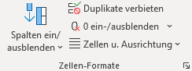

| Name                                               | Beschreibung                                       |
| -------------------------------------------------- | -------------------------------------------------- |
| Spalten ein/ausblenden                             | Alle ausgeblendeten Spalten zwischen aus- und einblenden umschalten.  Wenn keine ausgeblendeten Spalten zwischengespeichert bzw. im Blatt vorhanden sind, und Spalten markiert sind, werden diese ausgeblendet. |
| Spalten ein/ausblenden                             | Alle ausgeblendeten Spalten zwischen aus- und einblenden umschalten.  Wenn keine ausgeblendeten Spalten zwischengespeichert bzw. im Blatt vorhanden sind, und Spalten markiert sind, werden diese ausgeblendet. |
| Zeilen ein/ausblenden                              | Alle ausgeblendeten Zeilen zwischen aus- und einblenden umschalten.  Wenn keine ausgeblendeten Zeilen zwischengespeichert bzw. im Blatt vorhanden sind, und Zeilen markiert sind, werden diese ausgeblendet. |
| Alle Spalten und Zeilen einblenden                 | Alle ausgeblendeten Spalten und Zeilen wieder einblenden. |
| Ungenutzten Bereich ausblenden                     | Alle Spalten und Zeilen des nicht genutzten Bereichs ausblenden. |
| Ausgeblendete Spalten löschen                      | Alle ausgeblendeten Spalten löschen.               |
| Ausgeblendete Zeilen löschen                       | Alle ausgeblendeten Zeilen löschen.                |
| Duplikate verbieten                                | Verbietet Duplikate innerhalb der jeweils selektierten Bereiche über eine Datenüberprüfung. Bestehende Datenüberprüfungen werden dabei überschrieben. |
| 0 ein-/ausblenden                                  | Per Zellen-Format 0-Werte ausblenden und wieder einblenden. Dabei wird versucht, dass bestehende Zellen-Format zu erkennen und entsprechend anzupassen. |
| 0-Werte verstecken                                 | Per Zellen-Format ('0;;;@') 0-Werte ausblenden. Bestehendes Zellen-Format wird überschrieben. |
| Tausender zu 0,0 k                                 | Per Zellen-Format Tausenderbeträge als x,x k. anzeigen. Bestehendes Zellen-Format wird überschrieben. |
| Mio.-Werte zu 0,0 M                                | Per Zellen-Format Millionenbeträge als x,x Mio. anzeigen. Bestehendes Zellen-Format wird überschrieben. |
| Zellen u. Ausrichtung                              |                                                    |
| Zellen u. Ausrichtung > Verbundene Zellen ersetzen durch Über Auswahl zentrieren | Ersetzt verbundene Zellen innerhalb der aktuellen Auswahl durch die horizontale Ausrichtung 'Über Auswahl zentrieren', sofern die verbundenen Zellen aus einer Zeile bestehen und bisher zentriert formatiert waren. |
| Zellen u. Ausrichtung > Verbundene Zellen aufheben und Inhalte verteilen | Hebt verbundene Zellen innerhalb der aktuellen Auswahl auf und fügt den ursprünglichen Zelleninhalt in alle Zellen ein. |
| Zellen u. Ausrichtung > Blocksatz                  | Ausgewählte zellen als Blocksatz ausrichten.       |
| Zellen u. Ausrichtung > Gleichmäßig verteilt       | Ausgewählte zellen horizontal verteilt ausrichten (extremer Blocksatz). |
| Zellen u. Ausrichtung > Über Auswahl zentrieren    | Ausgewählte zellen 'Über Auswahl zentriert' ausrichten, d.h es werden verbundene Zellen simuliert. |
| Zellen u. Ausrichtung > Ausfüllen (Text bis Ende wiederholen) | Ausgewählte zellen 'Ausfüllen', d.h. Zelleninhalt wird optisch wiederholt über die gesamte Zellenbreite. |

### Kommentare

| Name                                               | Beschreibung                                       |
| -------------------------------------------------- | -------------------------------------------------- |
| *Neuer Kommentar*                                  | Fügen Sie eine Notiz zu diesem Teil des Dokuments hinzu. |
| *Form ändern*                                      | Die Form der Zeichnung ändern, wobei die gesamte Formatierung beibehalten wird. |
| *Fülleffekt*                                       | Füllen Sie die ausgewählte Form mit einer Volltonfarbe, einem Farbverlauf, einem Bild oder einer Textur. |
| *Bildrahmen*                                       | Wählen Sie die Farbe, Stärke und Art der Linie für die Kontur Ihrer Form aus. |
| *Zurück*                                           | Zum vorherigen Kommentar springen.                 |
| *Weiter*                                           | Zum nächsten Kommentar springen.                   |
| *Alle Kommentare anzeigen*                         | Alle Kommentare im Blatt anzeigen.                 |

### Rahmen

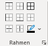

| Name                                               | Beschreibung                                       |
| -------------------------------------------------- | -------------------------------------------------- |
| *Rahmenlinie oben*                                 |                                                    |
| *Rahmenlinie links*                                |                                                    |
| *Horizontale Rahmenlinie innen*                    |                                                    |
| *Rahmenlinie rechts*                               |                                                    |
| *Rahmenlinie unten*                                |                                                    |
| *Vertikale Rahmenlinie innen*                      |                                                    |
| *Alle Rahmenlinien*                                |                                                    |
| *Kein Rahmen*                                      |                                                    |
| *Linienfarbe*                                      |                                                    |

### Definierte Namen

| Name                                               | Beschreibung                                       |
| -------------------------------------------------- | -------------------------------------------------- |
| *Namen definieren*                                 | Namen definieren und übernehmen.                   |
| *In Formel verwenden*                              | Einen in dieser Arbeitsmappe verwendeten Namen auswählen und in der aktuellen Formel einfügen. |
| *Aus Auswahl erstellen...*                         | Automatisch Namen aus den ausgewählten Zellen generieren.  Viele Benutzer verwenden den Text in der obersten Zeile oder der Spalte ganz links. |

### Datentools

| Name                                               | Beschreibung                                       |
| -------------------------------------------------- | -------------------------------------------------- |
| *PivotTable*                                       | In einer PivotTable können Sie komplexe Daten bequem anordnen und zusammenfassen.  Info: Klicken Sie doppelt auf einen Wert, um anzuzeigen, aus welchen Einzelwerten die zusammengefasste Summe besteht. |
| *Text in Tabelle umwandeln...*                     | Eine einzelne Textspalte in mehrere Spalten aufteilen.  Beispielsweise können Sie eine Spalte mit vollständigen Namen in separate Spalten für den Vor- und Nachnamen aufteilen.  Die Art, in der die Aufteilung erfolgt, können Sie auswählen: feste Breite oder bei jedem Komma, Punkt oder anderem Zeichen aufteilen. |
| *Duplikate entfernen*                              | Doppelte Zeilen aus einem Blatt löschen.  Sie können auswählen, welche Spalten auf doppelte Informationen überprüft werden sollen. |
| *Datenüberprüfung*                                 | Aus einer Liste mit Regeln auswählen, um den Datentyp einzuschränken, der in eine Zelle eingegeben werden kann.  Beispielsweise können Sie eine Liste mit Werten wie 1, 2 und 3 bereitstellen oder nur Zahlen als gültige Einträge zulassen, die größer als 1000 sind. |

### Fenster

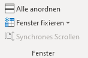

| Name                                               | Beschreibung                                       |
| -------------------------------------------------- | -------------------------------------------------- |
| *Alle anordnen*                                    | Stapeln Sie Ihre geöffneten Fenster, damit alle gleichzeitig zu sehen sind. |
| *Fenster fixieren*                                 | Einen Teil des Blatts fixieren, damit er auch dann angezeigt wird, wenn Sie durch das restliche Blatt scrollen.  Diese Funktion ist hilfreich, wenn Sie Daten an anderen Stellen des Arbeitsblatts prüfen möchten, ohne dabei Kopfzeilen oder Beschriftungen aus den Augen zu verlieren. |
| *Synchrones Scrollen*                              | In zwei Dokumenten gleichzeitig scrollen.  Dies ist eine komfortable Möglichkeit, um Dokumente Zeile für Zeile zu vergleichen oder nach Unterschieden zu suchen.  Aktivieren Sie "Nebeneinander anzeigen", um dieses Feature zu verwenden. |

### Drucken

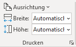

| Name                                               | Beschreibung                                       |
| -------------------------------------------------- | -------------------------------------------------- |
| *Ausrichtung*                                      | Richten Sie Ihre Seiten im Hoch- oder Querformat aus. |
| *Breite:*                                          | Die Breite der Druckausgabe so reduzieren, dass eine bestimmte Anzahl von Seiten darauf passt. |
| *Höhe:*                                            | Die Höhe der Druckausgabe so reduzieren, dass eine bestimmte Anzahl von Seiten darauf passt. |

## Toolbox 3/3 BETA

### Selektion

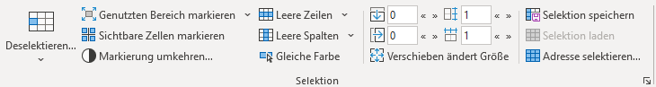

| Name                                               | Beschreibung                                       |
| -------------------------------------------------- | -------------------------------------------------- |
| Deselektieren…                                     | Aktuelle Selektion um gewählten Bereich reduzieren (Komplement). |
| Deselektieren…                                     | Aktuelle Selektion um gewählten Bereich reduzieren (Komplement). |
| Schnittmenge bilden…                               | Schnittmenge aus aktueller Selektion und gewähltem Bereich. |
| Vereinigung bilden…                                | Vereinigungsmenge aus aktueller Selektion und gewähltem Bereich. |
| Symmetrische Differenz bilden…                     | Symmetrische Differenz (Vereinigungsmenge abzüglich Schnittmenge) aus aktueller Selektion und gewähltem Bereich. |
| Genutzten Bereich markieren                        | Markiert den genutzten Bereich (UsedRange).        |
| Genutzten Bereich markieren                        | Markiert den genutzten Bereich (UsedRange).        |
| *Aktuellen Bereich markieren*                      |                                                    |
| Ungenutzten Bereich markieren                      | Markiert den ungenutzten Bereich.                  |
| *Sichtbare Zellen markieren*                       |                                                    |
| Markierung umkehren…                               | Markiert den nicht markierten Bereich innerhalb des gewählten Bereichs. |
| Leere Zeilen                                       | Alle leeren Zeilen innerhalb der benutzen Zellen (UsedRange) markieren. |
| Leere Zeilen markieren                             | Alle leeren Zeilen innerhalb der benutzen Zellen (UsedRange) markieren. |
| Ganze Zeilen markieren                             | Alle Zeilen der aktuell markierten Zellen markieren. |
| Leere Spalten                                      | Alle leeren Spalten innerhalb der benutzen Zellen (UsedRange) markieren. |
| Leere Spalten markieren                            | Alle leeren Spalten innerhalb der benutzen Zellen (UsedRange) markieren. |
| Ganze Spalten markieren                            | Alle Spalten der aktuell markierten Zellen markieren. |
| Gleiche Farbe                                      | Alle Zellen mit der gleichen Hintergrundfarbe wie die ausgewählten Zellen markieren. |
| Oben                                               | Selektion nach oben verschieben                    |
| Reihen                                             | Selektion um Reihen erweitern                      |
| Links                                              | Selektion nach links verschieben                   |
| Spalten                                            | Selektion um Spalten erweitern                     |
| Verschieben ändert Größe                           | Verschieben der Selektion verändert auch die Größe |
| Selektion speichern                                | Aktuelle Selektion zwischenspeichern, um diese später wiederherzustellen. |
| Selektion laden                                    | Zwischengespeicherte Selektion auf aktuellem Blatt wiederherstellen. |
| Adresse selektieren…                               | Zeigt Fenster zum Eingeben der Selektionsadresse mit der Adresse der aktuellen Selektion als Standardwert. |

### Blätter

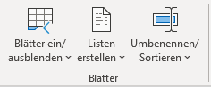

| Name                                               | Beschreibung                                       |
| -------------------------------------------------- | -------------------------------------------------- |
| Blätter ein/ausblenden                             | Alle ausgeblendeten Blätter zwischen ein- und ausblenden umschalten.  Sind keine Blätter ausgeblendet, werden die ausgewählten Blätter bzw. das aktuelle Blatt ausgeblendet. |
| Blätter ein/ausblenden                             | Alle ausgeblendeten Blätter zwischen ein- und ausblenden umschalten.  Sind keine Blätter ausgeblendet, werden die ausgewählten Blätter bzw. das aktuelle Blatt ausgeblendet. |
| Blätter anzeigen/verstecken (xlVeryHidden)         | Alle versteckten (xlVeryHidden) Blätter zwischen anzeigen und verstecken umschalten.   ind keine Blätter versteckt, werden die ausgewählten Blätter bzw. das aktuelle Blatt versteckt. |
| Blatt ausblenden                                   | Aktuelles Blatt bzw. ausgewählte Blätter ausblenden. |
| Blatt verstecken (xlVeryHidden)                    | Aktuelles Blatt bzw. ausgewählte Blätter verstecken (xlVeryHidden), sodass diese nur über die Toolbox oder ein Makro wieder sichtbar gemacht werden können. |
| Alle ausgeblendeten Blätter einblenden             | Alle ausgeblendeten Blätter wieder einblenden.     |
| Alle versteckten Blätter (nur xlVeryHidden) einblenden | Alle ausgeblendeten oder versteckten (xlVeryHidden) Blätter wieder einblenden. |
| Alle Blätter (inkl. xlVeryHidden) einblenden       | Alle ausgeblendeten oder versteckten (xlVeryHidden) Blätter wieder einblenden. |
| Listen erstellen                                   | Liste aller Blätter, Arbeitsmappen, Dateliste, ... |
| Listen erstellen > Liste aller Kommentare          | Erstellt Liste aller Kommentare des aktuellen Blatts in neuem Blatt. |
| Listen erstellen > Liste aller bedingten Formatierungen | Erstellt Liste aller bedingten Formatierungen des aktuellen Blatts in neuem Blatt. |
| Listen erstellen > Liste aller Datenüberprüfungen  | Erstellt Liste aller Datenüberprüfungen des aktuellen Blatts in neuem Blatt. |
| Listen erstellen > Liste aller Namen               | Erstellt Liste aller Namen dieser Arbeitsmappe in neuem Blatt. |
| Listen erstellen > Liste aller Arbeitsblätter      | Erstellt Liste aller Blätter dieser Arbeitsmappe in einem neuen Blatt. |
| Listen erstellen > Liste aller Dokumenteneigenschaften | Erstellt Liste aller Dokumenteneigenschaften dieser Arbeitsmappe in neuem Blatt. |
| Listen erstellen > Liste aller geöffneten Arbeitsmappen | Erstellt Liste aller geöffneten Arbeitsmappen inkl. Pfad in einem neuen Blatt. |
| Listen erstellen > Dateiliste erstellen…           | Wähle Ordner und erstelle Liste aller Dateien in diesem Ordner in neuem Blatt. |
| Listen erstellen > Dateiliste erstellen (rekursiv)… | Wähle Ordner und erstelle Liste aller Dateien in diesem Ordner und allen Unterordnern in neuem Blatt. |
| Listen erstellen > Ordnerliste erstellen (rekursiv)… | Wähle Ordner und erstelle Liste aller Ordner in diesem Ordner und allen Unterordnern in neuem Blatt. |
| Listen erstellen > Dateilisten-Einstellungen       |                                                    |
| Listen erstellen > Dateilisten-Einstellungen > Ordnerzeilen |                                                    |
| Listen erstellen > Dateilisten-Einstellungen > Gruppieren |                                                    |
| Listen erstellen > Dateilisten-Einstellungen > Einrücken |                                                    |
| Umbenennen/ Sortieren                              | Mehrere Arbeitsblätter gemäß einer Auswahl umbenennen oder erstellen aus Vorlage |
| Umbenennen/ Sortieren > Basisliste erstellen       | Erstellt Liste aller Blätter dieser Arbeitsmappe in einem neuen Blatt. |
| Umbenennen/ Sortieren > Blätter gemäß aktueller Auswahl umbenennen | Alle Blätter gemäß der Auswahl umbenennen. Die Auswahl muss aus genau 2 Spalten bestehen, wobei die erste Spalten den alten Namen und die zweite Spalte den neuen Namen enthält. Leere Namen werden übersprungen. |
| Umbenennen/ Sortieren > Blätter gemäß aktueller Auswahl sortieren | Alle Blätter gemäß der Auswahl sortieren. Die Auswahl muss aus genau einer Spalten mit den Blattnamen in der gewünschten Reihenfolge bestehen. |
| Umbenennen/ Sortieren > Blätter gemäß aktueller Auswahl erstellen | Neue Blätter gemäß der aktuellen Auswahl erstellen. Die Auswahl muss aus genauer einer Spalte mit den anzulegenden Blattnamen bestehen. |

### Arbeitsmappe

| Name                                               | Beschreibung                                       |
| -------------------------------------------------- | -------------------------------------------------- |
| Datei zurücksetzen                                 | Datei auf den zuletzt gespeicherten Zustand zurücksetzen. Die Datei wird dazu geschlossen ohne zu speichern und neu geöffnet. |
| Arbeitsmappen konsolidieren…                       | Konsolidiert die ausgewählten geöffneten Arbeitsmappen in einer neuen Arbeitsmappe, d.h. kopiert alle Blätter in eine Arbeitsmappe. Die aktuelle Arbeitsmappe wird nicht verändert. |
| Geöffnete Arbeitsmappen konsolidieren…             | Konsolidiert die ausgewählten geöffneten Arbeitsmappen in einer neuen Arbeitsmappe, d.h. kopiert alle Blätter in eine Arbeitsmappe. Die aktuelle Arbeitsmappe wird nicht verändert. |
| Dateien zum Konsolidieren auswählen…               | Konsolidiert die Blätter der ausgewählten Dateien in einer neuen Arbeitsmappe. Die aktuelle Arbeitsmappe wird nicht verändert. |
| Blätter in ein Blatt konsolidieren…                | Konsolidiert alle ausgewählten Blätter dieser Arbeitsmappe in einem neuen Blatt. |
| Alle Anderen schließen                             | Alle Arbeitsmappen außer der aktuellen Mappe schließen. Gibt es ungespeicherte Änderungen, kommt vorab eine Meldung. |
| Blätter kopieren                                   | Blätter aus der aktuellen Arbeitsmappe getrennt kopieren und einzeln speichern |
| Blätter kopieren > Markierte Blätter in neue Arbeitsmappe kopieren | Kopiert die markierten Arbeitsblätter in eine neue Arbeitsmappe. Dies funktioniert auch, wenn mehrere Blätter Listen und Tabellen enthalten. Die aktuelle Arbeitsmappe wird nicht verändert. |
| Blätter kopieren > Blätter in jeweils eigene Datei speichern… | Kopiert alle sichtbaren Blätter jeweils in eine neue Arbeitsmappe und speichert diese im gleichen Verzeichnis wie die aktuelle Arbeitsmappe. Die aktuelle Arbeitsmappe wird nicht verändert. |
| Theme & Color Scheme                               |                                                    |
| Theme & Color Scheme > Theme aus Datei anwenden    | Beliebige Excel-Datei auswählen und dessen Theme (Farb- und Fontschema) auf aktuelle Datei anwenden. |
| Theme & Color Scheme > Color Scheme                |                                                    |
| Theme & Color Scheme > Color Scheme > Export       | Exportiere Farbschema der Arbeitsmappe als XML-Datei. |
| Theme & Color Scheme > Color Scheme > Import       | Importiere Farbschema aus einer XML-Datei in die Arbeitsmappe. |
| Theme & Color Scheme > Font Scheme                 |                                                    |
| Theme & Color Scheme > Font Scheme > Export        | Exportiere Fontschema der Arbeitsmappe als XML-Datei. |
| Theme & Color Scheme > Font Scheme > Import        | Importiere Fontschema aus einer XML-Datei in die Arbeitsmappe. |
