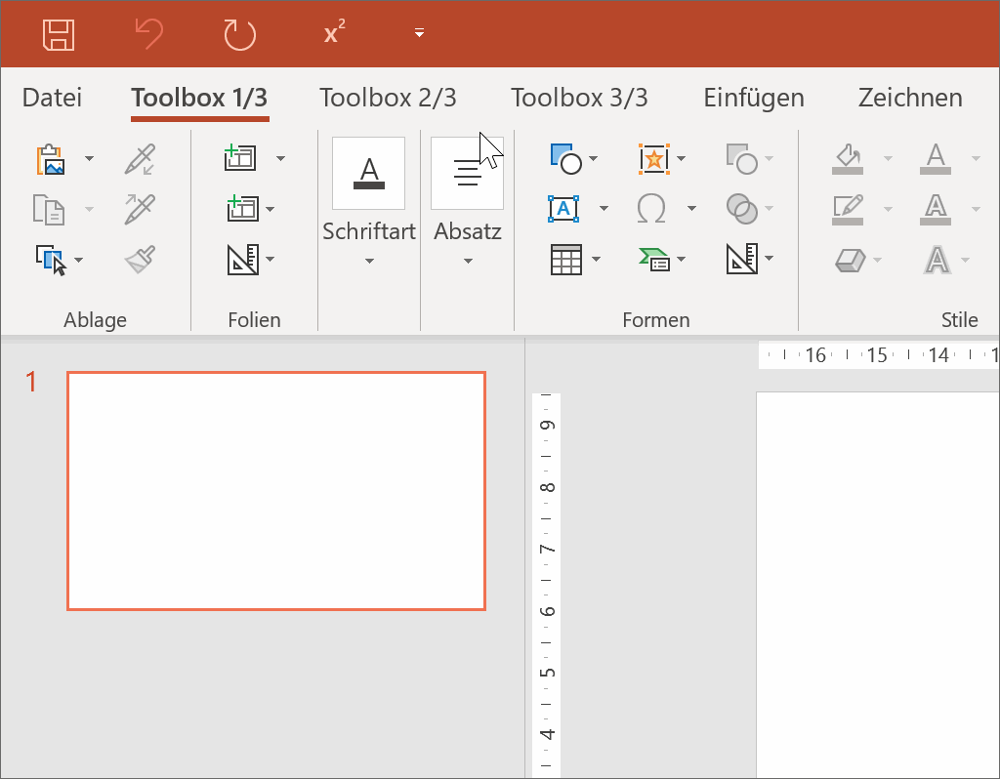
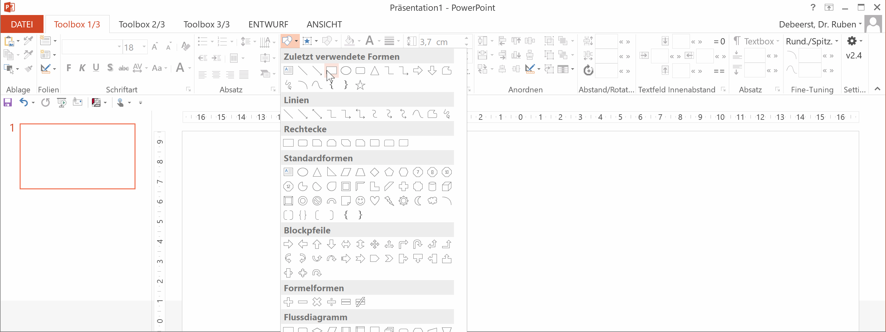
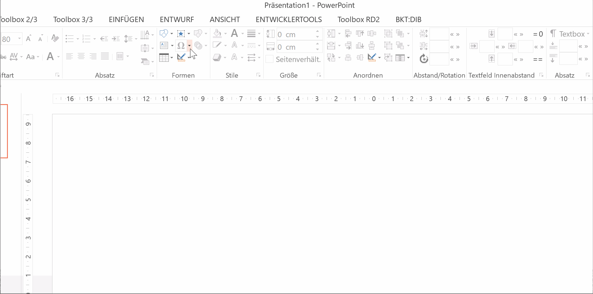
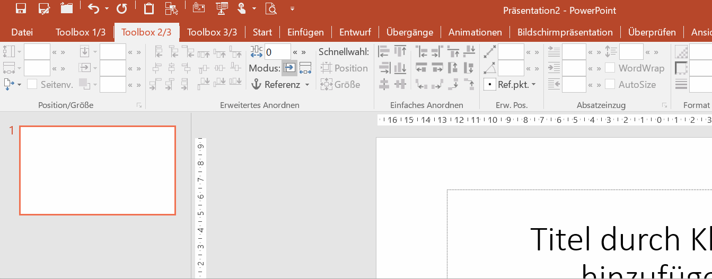
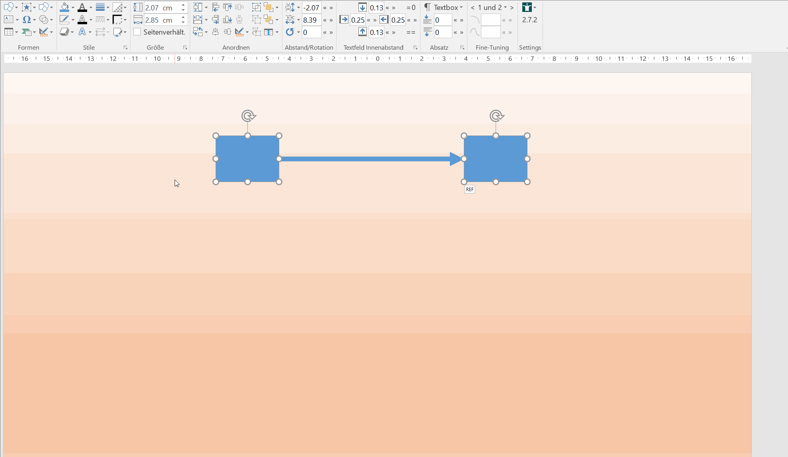

# QuickTipps
{:.no_toc}

Auf diese Seite befinden sich diverse kleine Animationen, die Tipps im Umgang mit PowerPoint und der BKT geben. Da die Animationen zu unterschiedlichen Zeitpunkten und mit verschiedenen BKT-Versionen aufgezeichnet wurden, kann es im Vergleich zur aktuellsten Version zu kleineren Abweichungen kommen.

1. TOC
{:toc}

<!-- 1. [PowerPoint allgemein](#powerpoint-allgemein)
   1. [Touchmodus zu Mausmodus ändern](#touchmodus-zu-mausmodus-ändern)
   1. [Fokus auf Kontext-Menüband Shape-Format verhindern](#fokus-auf-kontext-menüband-shape-format-verhindern)
   1. [Textzeichen in einzelne Shapes umwandeln](#textzeichen-in-einzelne-shapes-umwandeln)
   1. [Fokusbereiche auf Bild mit Transparenz-Overlay erstellen](#fokusbereiche-auf-bild-mit-transparenz-overlay-erstellen)
   1. Schnellzugriff mit Tastenkombination
   1. Hintergrund-Typ Folienhintergrund nutzen
1. [Shapes ausrichten oder angleichen](#shapes-ausrichten-oder-angleichen)
   1. [Shapes über mehrere Folien verknüpfen und angleichen](#shapesüber-mehrere-folien-verknüpfen-und-angleichen)
   1. [Shapes in Tabellen, Paragraphen, oder anderen Shapes anordnen](#shapes-in-tabellen-paragraphen-oder-anderen-shapes-anordnen)
   1. Shape-Abstand gezielt anpassen
   1. Erweitertes Anordnen nach Referenzshape
   1. Erweitertes Positionieren (Winkel und euklidischer Abstand)
   1. Shape-Position und -Größe mit Fixpunkt
   1. Shapes als Tabellen ausrichten
   1. Shapes kreisförmig ausrichten
1. [Shape-Inhalte verändern (Text, Format)](#shape-inhalte-verändern-text-format)
   1. [Text mehrerer Shapes ersetzen und löschen](#text-mehrerer-shapes-ersetzen-und-löschen)
   1. Sprache für Rechtschreibprüfung festlegen
   1. Formate mehrerer Shapes angleichen
   1. Shapes skalieren
1. [Spezielle BKT-Shapes](#spezielle-bkt-shapes)
   1. [Ampel-Shape mit Popup zum schnellen Wechseln](#ampel-shape-mit-popup-zum-schnellen-wechseln)
   1. Harvey-Balls einfügen
   1. Agenda einfügen und aktualisieren
   1. Shape-Tabelle anlegen
   1. Aktualisierbare Folien-Thumbnails anlegen
1. [Weitere BKT-Funktionen](#weitere-bkt-funktionen)
   1. [Tastenkombinationen beim Anordnen und Spinner-Boxen](#tastenkombinationen-beim-anordnen-und-spinner-boxen)
   1. [Schnellanleitung der QuickEdit Toolbar](#schnellanleitung-der-quickedit-toolbar)
   1. [Benutzerdefinierte Formate/Style](#benutzerdefinierte-formate)
   1. Ungenutzte Folienlayouts löschen
   1. Eigene Shape-Library anlegen
   1. Chart-Library mit Folienmastern
   1. Shapes gezielt auswählen
   1. Icons mit Icon-Fonts
   1. Shapes teilen oder vervielfachen
   1. Shape-Statistiken anzeigen
   1. Folien-Notizen anlegen und löschen
   1. Toolbar-Themes und Einstellungen
1. *more to come...* -->

---

## PowerPoint allgemein

### Touchmodus zu Mausmodus ändern

Standardmäßig ist Office nach der Installation für die Fingereingabe optimiert. Buttons sind größer und nicht alle Controls der BKT-Toolbox direkt sichtbar, z.B. verschwinden Schriftart und Absatz in Untermenüs. Hier zeige ich euch, wie ihr die Eingabe auf "Maus" umstellt.

### Fokus auf Kontext-Menüband Shape-Format verhindern

PowerPoint wechselt normalerweise bei Erstellung neuer Shapes immer in das Kontext-Menüband "Shape-Format". Wenn man das verhindern möchte und dieses Menüband auch grundsätzlich nicht verwendet, kann man es einfach vollständig ausblenden. Dadurch bleibt der Fokus auf dem BKT-Menüband.
_Hinweis: In der neuesten BKT-Version geht dies auch in den BKT-Einstellungen (Button ganz rechts oben im Toolbar-Tab) unter "Format-Tab ausblenden"._

### Textzeichen in einzelne Shapes umwandeln

Mit der Funktion “In Einzelmengen zerlegen” kann man in PowerPoint Text-Zeichen in Shapes umwandeln. Das ist dann hilfreich, wenn der Adressat einen bestimmten Font nicht hat, oder wenn man ein Zeichen aus einem Symbolfont (z.B. Fontawesome) customizen möchte.
_Hinweis: In der neuesten BKT-Version ist diese Funktion mit einem Button implementiert in der Gruppe "Formen" unter "Shape verändern"._

### Fokusbereiche auf Bild mit Transparenz-Overlay erstellen

Oft möchte man auf einem bestehenden Slide oder Bild die Aufmerksamkeit auf bestimmte Teilausschnitte legen. PowerPoint bietet dazu die Möglichkeit Shapes in Einzelteile zu zerlegen, wodurch man “Löcher” in einem transparenten Shape erzeugen kann.

### Schnellzugriff mit Tastenkombination

Für den schnellen Zugriff auf Funktionen kann man diese in die Symbolleiste für den Schnellzugriff legen und mit `Alt`-Taste und der angezeigten Ziffer aufrufen.

### Hintergrund-Typ Folienhintergrund nutzen

In manchen Situationen kann es sehr hilfreich sein, wenn ein Shape exakt dem Folienhintergrund entspricht und damit quasi unsichtbar ist.

## Shapes ausrichten oder angleichen

### Shapes über mehrere Folien verknüpfen und angleichen

Die Funktion zum verknüpfen von Shapes ist super für Sticker oder auch Tracker. Bestehende Shapes können miteinander verknüpft werden, entweder automatisch (wenn Position und Größe bereits übereinstimmen), oder über eine manuelle Auswahl.
_Hinweis: In der neuesten BKT-Version können verknüpfte Shapes auch über das Shape-Kontextmenü angelegt werden. Bei der Suche nach vorhandenen Shapes sind verschiedene Parameter und ein Toleranzwert einstellbar. Bei verknüpften Shapes kommt automatisch ein kleines Popup zur schnellen Aktualisierung._

### Shapes in Tabellen, Paragraphen, oder anderen Shapes anordnen

Es gibt eine sehr mächtige Funktion um Shapes innerhalb von Tabellenzellen, Paragraphen oder anderen Shapes auszurichten. Die Positionierung wird automatisch abhängig von den darunterliegenden Shapes bestimmt, kann aber auch manuell festgelegt werden. Funktioniert die automatische Erkennung nicht, kann die Shape-Anordnungs-Funktion auch manuell gewählt werden.

### Shape-Abstand gezielt anpassen

Mit der BKT kann der horizontale und vertikale Abstand zwischen mehrere Shapes genau eingestellt werden. Außerdem kann der visuelle Abstand bei rotierten Shapes berechnet werden.

### Erweitertes Anordnen nach Referenzshape

Mit dem erweiterten Anordnen können Shapes anhand des zuletzt gewählten Shapes ausgerichtet werden. Außerdem kann ein Referenzshape definiert werden, um folienübergreifend Shapes auszurichten.

### Erweitertes Positionieren (Winkel und euklidischer Abstand)

Mit dem erweiterten Positionieren kann der Winkel zwischen Shapes geändert werden sowie der euklidische Abstand geändert werden. Außerdem können mehrere Shapes auf einem Vektor verteilt werden.

### Shape-Position und -Größe mit Fixpunkt

Die Shape-Größe und -Position kann pixelgenau eingestellt werden, wobei eine beliebige Shape-Ecke als Fixpunkt gewählt werden kann. Mit der `Alt`-Taste kann jedes Shape einzeln um das Delta angepasst werden.

### Shapes als Tabellen ausrichten

Wenn mehrere Shapes in Tabellenform ausgerichtet werden sollen, kann die BKT diese erkennt und die Abstände entsprechend angleichen. Außerdem kann die Tabelle angepasst werden, bspw. die Shape-Größen angeglichen oder die gesamte Tabelle transponiert.

### Shapes kreisförmig ausrichten

Die BKT kann mehrere Shapes kreisförmig anordnen, wahlweise mit Zentrum und rotierten Shapes um das Zentrum.

## Shape-Inhalte verändern (Text, Format)

### Text mehrerer Shapes ersetzen und löschen

Der Text mehrerer Shapes kann sehr einfach auf einen Wert geändert oder komplett gelöscht werden. Außerdem werden mehrere Nummerierungsmöglichkeiten über \[count\] als Variable unterstützt. Dies geht über das Textbox-Untermenü oder im Kontextmenü bei Auswahl mehrerer Textshapes.
_Hinweis: In neueren BKT-Versionen heißt die Variable $counter und nicht \[counter\]._

## Spezielle BKT-Shapes

### Ampel-Shape mit Popup zum schnellen Wechseln

Das Ampel-Shape ist eines der ersten "intelligenten" Shapes. Bei Selektion wird ein Dialog/Popup angezeigt, der ein schnelles Umschalten der Ampel ermöglicht. Man kann es einfügen in der Gruppe "Formen"->"Spezielle und Interaktive Formen"->"Ampel".

## Weitere BKT-Funktionen

### Tastenkombinationen beim Anordnen und Spinner-Boxen

Viele Buttons und Textboxen erlaubt mittels `Strg` oder `Shift` Taste schnellen Zugriff auf Unterfunktionen oder Variation der Schrittweite der Spinner-Boxen.

### Benutzerdefinierte Formate

Seit Version 2.5.2 kann man eigene Formate speichern und anwenden. Dabei kann man auswählen, welche Bereiche angepasst werden sollen. Auch verschiedene Listen-Einrückungen werden berücksichtigt. Zu guter letzt werden mehrere Bibliotheken unterstützt und es gibt sogar eine Pickup-Apply Funktion. _Hinweis: Das Feature muss bei der Installation aktiviert werden._

### Schnellanleitung der QuickEdit Toolbar

Die BKT bietet eine multi-funktionale Toolbar mit Farb-Buttons an, genannt QuickEdit. Die Funktionen der Buttons können mit `Shift`, `Strg` und `Alt`-Taste variiert werden. Alle Details im Kontextmenü oben in der QuickEdit Toolbar unter Hilfe.
