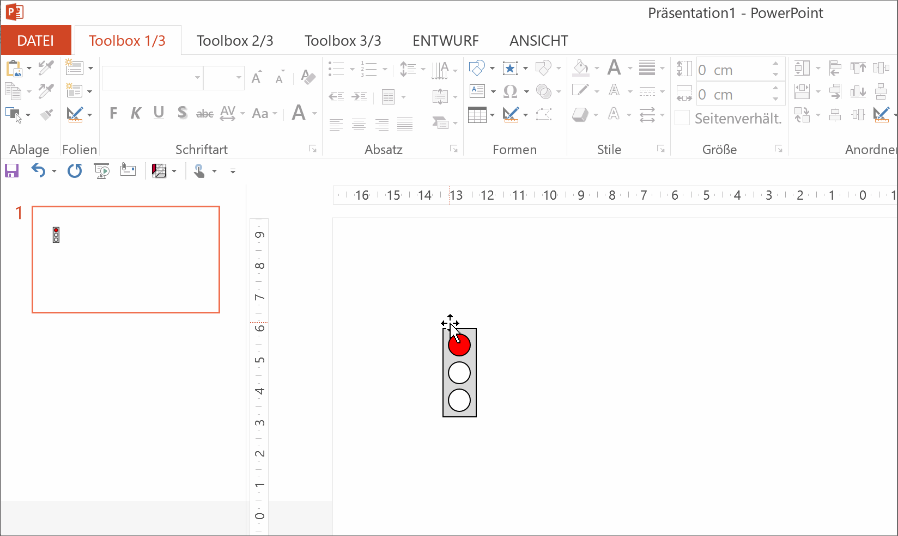
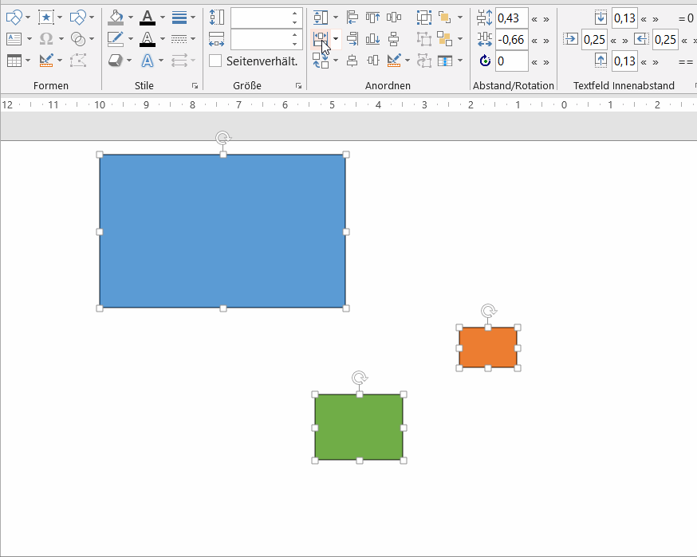
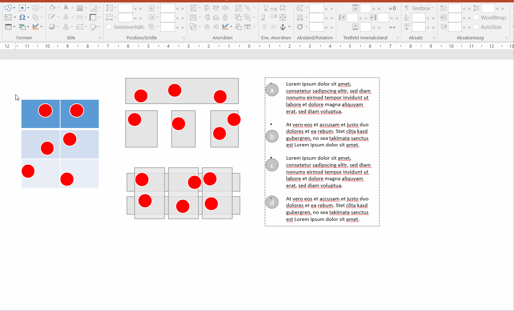

# QuickTipps

1. [Touchmodus zu Mausmodus ändern](#touchmodus-zu-mausmodus-ändern)
1. [Schnellanleitung der QuickEdit Toolbar](#schnellanleitung-der-quickedit-toolbar)
1. [Shapes über mehrere Folien verknüpfen und angleichen](#shapesüber-mehrere-folien-verknüpfen-und-angleichen)
1. [Ampel-Shape mit Popup zum schnellen Wechseln](#ampel-shape-mit-popup-zum-schnellen-wechseln)
1. [Fokusbereiche auf Bild mit Transparenz-Overlay erstellen](#fokusbereiche-auf-bild-mit-transparenz-overlay-erstellen)
1. [Textzeichen in einzelne Shapes umwandeln](#textzeichen-in-einzelne-shapes-umwandeln)
1. [Fokus auf Kontext-Menüband Shape-Format verhindern](#fokus-auf-kontext-menüband-shape-format-verhindern)
1. [Tastenkombinationen beim Anordnen und Spinner-Boxen](#tastenkombinationen-beim-anordnen-und-spinner-boxen)
1. [Benutzerdefinierte Formate/Style](#benutzerdefinierte-formate)
1. [Shapes in Tabellen, Paragraphen, oder anderen Shapes anordnen](#shapes-in-tabellen-paragraphen-oder-anderen-shapes-anordnen)
1. *more to come...*

---

## Touchmodus zu Mausmodus ändern

Standardmäßig ist Office nach der Installation für die Fingereingabe optimiert. Buttons sind größer und nicht alle Controls der BKT-Toolbox direkt sichtbar, z.B. verschwinden Schriftart und Absatz in Untermenüs. Hier zeige ich euch, wie ihr die Eingabe auf "Maus" umstellt.

## Schnellanleitung der QuickEdit Toolbar

Die BKT bietet eine multi-funktionale Toolbar mit Farb-Buttons an, genannt QuickEdit. Die Funktionen der Buttons können mit `Shift`, `Strg` und `Alt`-Taste variiert werden. Alle Details im Kontextmenü oben in der QuickEdit Toolbar unter Hilfe.

## Shapes über mehrere Folien verknüpfen und angleichen

Die Funktion zum verknüpfen von Shapes ist super für Sticker oder auch Tracker. Bestehende Shapes können miteinander verknüpft werden, entweder automatisch (wenn Position und Größe bereits übereinstimmen), oder über eine manuelle Auswahl.
_Hinweis: In der neuesten BKT-Version können verknüpfte Shapes auch über das Shape-Kontextmenü angelegt werden. Bei der Suche nach vorhandenen Shapes sind verschiedene Parameter und ein Toleranzwert einstellbar. Bei verknüpften Shapes kommt automatisch ein kleines Popup zur schnellen Aktualisierung._

## Ampel-Shape mit Popup zum schnellen Wechseln

Das Ampel-Shape ist eines der ersten "intelligenten" Shapes. Bei Selektion wird ein Dialog/Popup angezeigt, der ein schnelles Umschalten der Ampel ermöglicht. Man kann es einfügen in der Gruppe "Formen"->"Spezielle und Interaktive Formen"->"Ampel".

## Fokusbereiche auf Bild mit Transparenz-Overlay erstellen

Oft möchte man auf einem bestehenden Slide oder Bild die Aufmerksamkeit auf bestimmte Teilausschnitte legen. PowerPoint bietet dazu die Möglichkeit Shapes in Einzelteile zu zerlegen, wodurch man “Löcher” in einem transparenten Shape erzeugen kann.

## Textzeichen in einzelne Shapes umwandeln

Mit der Funktion “In Einzelmengen zerlegen” kann man in PowerPoint Text-Zeichen in Shapes umwandeln. Das ist dann hilfreich, wenn der Adressat einen bestimmten Font nicht hat, oder wenn man ein Zeichen aus einem Symbolfont (z.B. Fontawesome) customizen möchte.
_Hinweis: In der neuesten BKT-Version ist diese Funktion mit einem Button implementiert in der Gruppe "Formen" unter "Shape verändern"._

## Fokus auf Kontext-Menüband Shape-Format verhindern

PowerPoint wechselt normalerweise bei Erstellung neuer Shapes immer in das Kontext-Menüband "Shape-Format". Wenn man das verhindern möchte und dieses Menüband auch grundsätzlich nicht verwendet, kann man es einfach vollständig ausblenden. Dadurch bleibt der Fokus auf dem BKT-Menüband.
_Hinweis: In der neuesten BKT-Version geht dies auch in den BKT-Einstellungen (Button ganz rechts oben im Toolbar-Tab) unter "Format-Tab ausblenden"._

## Tastenkombinationen beim Anordnen und Spinner-Boxen

Viele Buttons und Textboxen erlaubt mittels `Strg` oder `Shift` Taste schnellen Zugriff auf Unterfunktionen oder Variation der Schrittweite der Spinner-Boxen.

## Benutzerdefinierte Formate

Seit Version 2.5.2 kann man eigene Formate speichern und anwenden. Dabei kann man auswählen, welche Bereiche angepasst werden sollen. Auch verschiedene Listen-Einrückungen werden berücksichtigt. Zu guter letzt werden mehrere Bibliotheken unterstützt und es gibt sogar eine Pickup-Apply Funktion. _Hinweis: Das Feature muss bei der Installation aktiviert werden._

## Shapes in Tabellen, Paragraphen, oder anderen Shapes anordnen

Es gibt eine sehr mächtige Funktion um Shapes innerhalb von Tabellenzellen, Paragraphen oder anderen Shapes auszurichten. Die Positionierung wird automatisch abhängig von den darunterliegenden Shapes bestimmt, kann aber auch manuell festgelegt werden. Funktioniert die automatische Erkennung nicht, kann die Shape-Anordnungs-Funktion auch manuell gewählt werden.